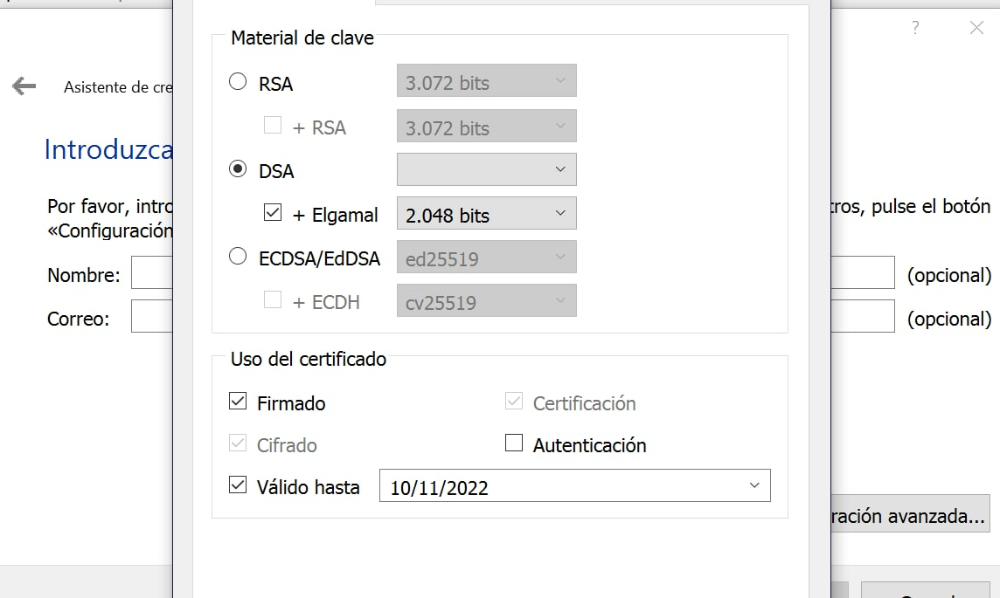
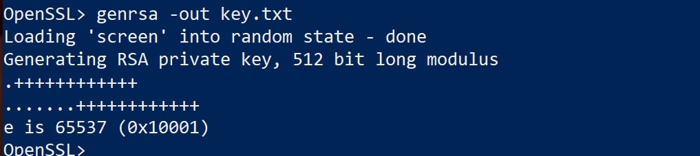
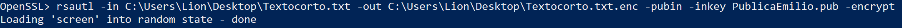
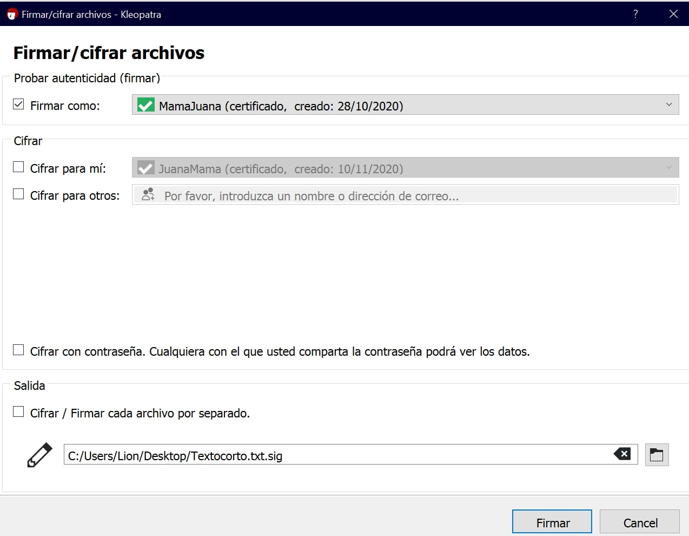

\clearpage

# Cifrado simétrico con OpenSSL

## Cifrado de mensaje de prueba local

Hemos dejado nuestros archivos en un fichero llamado `part-1a.sh`, que realiza
las operaciones automáticamente. Está documentado y presentado aquí:

```bash
#!/usr/bin/env bash

# Esto se asegura de que ningún subcomando falla, y que mostramos todos los
# comandos ejecutados, incluidas las variables sustituidas en cada uno.
set -eux
set -o errexit

# -pbkdf2 = Deriva la clave de la contraseña mejor.

# Nuestra contraseña, muy segura.
PASSWORD="1234"

# Crea un archivo con el texto plano que vamos a cifrar.
echo "Hola, mundo" > plaintext.txt

# Vamos a probar con salt y sin él.
for salt in "-salt" "-nosalt"; do
  # Vamos a probar salida binaria y en base64.
  for base64 in "" "-base64"; do
    # Vamos a probar con todos los modos del cifrado de bloque.
    for mode in cbc cfb ecb ofb; do
      # Vamos a probar varios algoritmos interesantes.
      for algorithm in rc5 seed camellia-128 aes-128; do
        # Lo encriptamos...
        openssl enc -e \
                    -in plaintext.txt \
                    -out plaintext.$algorithm-$mode$base64$salt \
                    -$algorithm-$mode \
                    -pass pass:$PASSWORD \
                    -pbkdf2 $base64 $salt
        # Y lo desencriptamos...
        openssl enc -d \
                    -in plaintext.$algorithm-$mode$base64$salt \
                    -out plaintext.$algorithm-$mode$base64$salt.txt \
                    -$algorithm-$mode \
                    -pass pass:$PASSWORD \
                    -pbkdf2 $base64 $salt
      done
    done
  done
done

# Mostramos todos los ficheros desencriptados y el texto plano, todos deberían
# ser iguales.
for f in *.txt; do
  cat "$f"
done
```

Corriendo el script, podemos comprobar que los mensajes antes y después son
correctos. Las opciones usadas se describen a continuación:

 * `-e`: Modo de cifrado.
 * `-d`: Modo de descifrado.
 * `-in`: Fichero de entrada.
 * `-out`: Fichero de salida.
 * `-pass`: Especifica la contraseña. El script usa `pass:$PASSWORD`, que pasa
   la contraseña por la línea de comandos. También podría usar `file:$f`, que
   usa un fichero con la contraseña. Estas dos sintaxis sustituyen a `-k`
   y `-kfile`.
 * `-base64`: Especifica que la salida o entrada (dependiendo de si estás
   cifrando o descifrando, respectivamente) será en formato
   [base64](https://en.wikipedia.org/wiki/Base64), que garantiza que toda la
   salida es ASCII.
 * `-a`: Un alias para `-base64`.
 * `-salt`: Especifica que salting debe ser usado. El salt son una serie de
   datos extra que se proveen a la hora de cifrar, y que se preservan en el
   texto cifrado (los primeros 8 bytes del texto cifrado se reservan para el
   salt si está habilitado). Por defecto se genera de manera aleatoria pero se
   puede especificar de forma manual via la opción `-S`.
 * `-nosalt`: Evita usar salting (salting está habilitado por defecto).
   Generalmente esta es una opción insegura, porque permite ataques de
   diccionario eficientes sobre la contraseña (porque sin salting, la misma
   contraseña siempre genera la misma clave de cifrado).

### ¿El mensaje cifrado es de mayor o menor tamaño que el mensaje original?

El mensaje cifrado siempre es al menos tan grande como el texto original.

Es posible que hubiera algún algoritmo que además de cifrado ejecutara algún
tipo de compresión, pero no es el caso en los algoritmos que estamos usando:
estamos usando algoritmos de cifrado en bloques (block ciphers), que por
definición tienen el mismo tamaño de entrada y salida (una vez acomodas la
entrada al tamaño de los bloques del determinado algoritmo).

Podemos comprobar esto muy fácilmente usando `ls -lhS` tras ejecutar el
script, que ordena todos los ficheros de mayor a menor tamaño.

### ¿El tamaño depende del algoritmo de cifrado utilizado, del tamaño del mensaje original o de ambos?

El tamaño depende de ambos. El **tamaño del mensaje original** cambia el número
de bloques que se cifran (y por definición ya que estamos usando cifrado de
bloques, tiene que incrementar el tamaño de la salida).

La **elección del algoritmo** afecta al tamaño de los bloques (así que
dependiendo de la entrada, dos algoritmos diferentes pueden necesitar más
o menos bloques para el mismo texto, y por lo tanto más o menos espacio en
  total).

Además, parece ser que `openssl` elimina **bloques vacíos** al final del
fichero, así que el mismo algoritmo en diferente modo de operación también puede
cambiar el tamaño de la salida. Por ejemplo, con nuestra clave y texto plano del
script, `plaintext.aes-128-cbc-nosalt` usa 16 bytes, mientras que
`plaintext.aes-128-cfb-nosalt` usa 12 bytes, que es algo que normalmente sería
imposible porque un sólo bloque debería de ocupar 16 bytes).

El **formato de salida** (binaria o base64) obviamente también afecta a la salida
(base64 es más grande porque necesitas cuatro caracteres por cada 3 bytes).

Finalmente, **salting** también añade al tamaño del fichero de salida, ya que el
salt se incluye en el fichero cifrado como un prefijo (y el salt, que también se
cifra, puede hacer que se necesite algún bloque extra).

## Determinar qué algoritmo de cifrado se utiliza en las conexiones HTTPs

Visitando `usal.es` en Firefox, podemos usar el icono del candado, o usar
`Ctrl+I` para ir a la ventana de información de la página, que contiene una
pestaña de seguridad:


Ahí podemos ver que el algoritmo usado es `TLS_AES256_GCM_SHA384`, con claves de
256 bits), y que estamos usando TLS 1.3.

Esa cadena especifica:

 * El protocolo (`TLS`).
 * `AES256_GCM`: Cifrado de bloques usando `AES`, con clave de 256 bits (el
   tamaño de bloque en `AES` es siempre 128 bits), en
   [Galois/Counter Mode](https://en.wikipedia.org/wiki/Galois/Counter_Mode) (un
   modo de operación que es muy
   [eficiente](https://crypto.stanford.edu/RealWorldCrypto/slides/gueron.pdf) en
   procesadores modernos)
 * `SHA384`: El algoritmo de hashing que se utiliza para comprobar la integridad
   de los datos. `SHA384` es una variante de `SHA-2`, con una salida de 384
   bits.

Podríamos haber obtenido la misma información, dicho eso, desde la línea de
comandos con una herramienta como `curl` así:

```
$ curl -v https://usal.es -o /dev/null 2>&1 | grep SSL | head -1
* SSL connection using TLSv1.3 / TLS_AES_256_GCM_SHA384
```

Siguiendo cualquiera de los dos procesos vamos a probar otras páginas web:

```
$ curl -v https://google.es -o /dev/null 2>&1 | rg SSL | head -1
* SSL connection using TLSv1.3 / TLS_AES_256_GCM_SHA384
```

Vaya, Google usa el mismo algoritmo que la USAL, oh well, no hay gran cosa en la
que podamos elaborar.

```
$ curl -v https://crisal.io -o /dev/null 2>&1 | rg SSL | head -1
* SSL connection using TLSv1.2 / ECDHE-RSA-AES256-GCM-SHA384
```

La página web de Emilio utiliza TLS 1.2, y aunque también utiliza `AES256_GCM`
como algoritmo de cifrado, y `SHA384` como algoritmo de hashing, vemos que hay
algún otro campo interesante:

 * [`ECDHE`](https://www.ecdhe.com/): *Elliptic Curve Diffie-Hellman Ephemeral*,
   un protocolo mediante el cual dos personas, cada cual con una clave privada
   y una pública, pueden intercambiar un secreto de forma segura a través de un
   canal inseguro.

   Este protocolo es cómo se consigue intercambiar una clave que luego se usa
   para cifrar via `AES256`, y es una variante del protocolo de
   [Diffie-Hellman](https://en.wikipedia.org/wiki/Diffie%E2%80%93Hellman_key_exchange),
   pero usando curvas elípticas en vez de números primos.

 * `RSA`: El algoritmo usado por la clave pública del certificado SSL del
   servidor.

# Cifrado asimétrico

## Cifrar un mensaje con GnuPG

### RSA

#### Generación de las claves

Emilio ya tenía una clave `rsa4096` que utiliza para firmar sus commits
e intercambiar correo. La parte pública de la clave está
[aquí](https://crisal.io/emilio.pgp.txt). Para exportarla ha usado:

```
$ gpg --armor --export E776A50333C0C653FC8ADE00E1152D0994E4BF8A >emilio.pgp.txt
```

Para generar su clave RSA Carlos usó la interfaz de Kleopatra para Windows.


#### Importación de las claves

Tras la generación de claves, intercambiamos nuestras llaves públicas tras
intercambiarlas exportadas como ASCII. Para importar la clave de Carlos, Emilio
ejecutó:

```
$ gpg --import ~/Downloads/Carlos.txt
```

Y tras ello Emilio firmó la clave de Carlos (para que sea considerada fiable).

```
$ gpg --edit-key MamaJuana
gpg (GnuPG) 2.2.23; Copyright (C) 2020 Free Software Foundation, Inc.
This is free software: you are free to change and redistribute it.
There is NO WARRANTY, to the extent permitted by law.


pub  rsa4096/E320B4EAC9869398
     created: 2020-10-28  expires: 2022-10-28  usage: SC
     trust: unknown       validity: unknown
sub  rsa4096/355EFA2A6B1855F3
     created: 2020-10-28  expires: 2022-10-28  usage: E
[ unknown] (1). MamaJuana

gpg> trust
pub  rsa4096/E320B4EAC9869398
     created: 2020-10-28  expires: 2022-10-28  usage: SC
     trust: unknown       validity: unknown
sub  rsa4096/355EFA2A6B1855F3
     created: 2020-10-28  expires: 2022-10-28  usage: E
[ unknown] (1). MamaJuana

Please decide how far you trust this user to correctly verify other users' keys
(by looking at passports, checking fingerprints from different sources, etc.)

  1 = I don't know or won't say
  2 = I do NOT trust
  3 = I trust marginally
  4 = I trust fully
  5 = I trust ultimately
  m = back to the main menu

Your decision? 4

pub  rsa4096/E320B4EAC9869398
     created: 2020-10-28  expires: 2022-10-28  usage: SC
     trust: full          validity: unknown
sub  rsa4096/355EFA2A6B1855F3
     created: 2020-10-28  expires: 2022-10-28  usage: E
[ unknown] (1). MamaJuana
Please note that the shown key validity is not necessarily correct
unless you restart the program.

gpg> sign

pub  rsa4096/E320B4EAC9869398
     created: 2020-10-28  expires: 2022-10-28  usage: SC
     trust: full          validity: unknown
 Primary key fingerprint: 1528 CE98 ADF1 BDD8 D4E3  0C1F E320 B4EA C986 9398

     MamaJuana

This key is due to expire on 2022-10-28.
Are you sure that you want to sign this key with your
key "Emilio Cobos Álvarez <emilio@crisal.io>" (E1152D0994E4BF8A)

Really sign? (y/N) y
gpg> save
```

#### Cifrado y firma de ficheros

Tras esto, Emilio le ha enviado un fichero simple a Carlos, tanto cifrado como
firmado:

```
$ echo 'Hola, Carlos!' > importante.txt
$ gpg -r MamaJuana --sign --encrypt importante.txt
```

Esto deja el fichero firmado y cifrado en `importante.txt.gpg`. Carlos cifra un
pequeño `.gitignore` que tenía en su Escritorio.


Una vez intercambian los ficheros cifrados y firmados se descifran
respectivamente:

```
$ gpg --decrypt gitignore.gpg >gitignore.txt
gpg: encrypted with 4096-bit RSA key, ID 355EFA2A6B1855F3, created 2020-10-28
      "MamaJuana"
gpg: encrypted with 4096-bit RSA key, ID 0AC3B8E770BECBCA, created 2018-12-26
      "Emilio Cobos Álvarez <emilio@crisal.io>"
gpg: Signature made Wed 28 Oct 2020 09:22:36 PM CET
gpg:                using RSA key 1528CE98ADF1BDD8D4E30C1FE320B4EAC9869398
gpg: Good signature from "MamaJuana" [full]
$ cat gitignore.txt
node_modules/

*/tablas/*.txt
```


Por curiosidad, Carlos también envió a Emilio un capítulo del Quijote en texto
plano.

#### Tamaño de los ficheros

Como se sugiere en el enunciado de la práctica, comparamos el tamaño de los
ficheros cifrados y planos.

 * `importante.txt`: 14 bytes
 * `importante.txt.pgp`: 1.2 kB (1201 bytes)
 * `gitignore.gpg`: 1.7 kB (1731 bytes)
 * `gitignore`: 31 bytes
 * `quijote.txt.gpg`: 116.2 kB (116230 bytes)
 * `quijote.txt`: 319 kB (319031 bytes)

La razón por la que el tamaño de los ficheros cifrados puede ser menor que el
texto plano es que gpg por defecto aplica compresión durante el cifrado. Para
evitar eso, podríamos haber utilizado el parámetro `--compress-algo=none`. Por
defecto, gpg utiliza compresión `zip`, pero también podría utilizar `bzip2`
o `zlib`, por ejemplo.

Según el manual:

> If this option is not used, the default behavior is to examine the recipient
> key preferences to see which algorithms the recipient sup‐ ports. If all else
> fails, ZIP is used for maximum compatibility.

### El Gamal + DSA

#### Generación de las claves

Para generar una clave gpg usando El Gamal + DSA, Emilio utilizó `gpg
--full-generate-key`:

```
$ gpg --full-generate-key
gpg (GnuPG) 2.2.23; Copyright (C) 2020 Free Software Foundation, Inc.
This is free software: you are free to change and redistribute it.
There is NO WARRANTY, to the extent permitted by law.

Please select what kind of key you want:
   (1) RSA and RSA (default)
   (2) DSA and Elgamal
   (3) DSA (sign only)
   (4) RSA (sign only)
  (14) Existing key from card
Your selection? 2
DSA keys may be between 1024 and 3072 bits long.
What keysize do you want? (2048)
Requested keysize is 2048 bits
Please specify how long the key should be valid.
         0 = key does not expire
      <n>  = key expires in n days
      <n>w = key expires in n weeks
      <n>m = key expires in n months
      <n>y = key expires in n years
Key is valid for? (0) 0
Key does not expire at all
Is this correct? (y/N) y

GnuPG needs to construct a user ID to identify your key.

Real name: Emilio Cobos Álvarez
Email address: emiliocobos+practica1b2@usal.es
Comment: Throwaway
You are using the 'utf-8' character set.
You selected this USER-ID:
    "Emilio Cobos Álvarez (Throwaway) <emiliocobos+practica1b2@usal.es>"

Change (N)ame, (C)omment, (E)mail or (O)kay/(Q)uit? O
We need to generate a lot of random bytes. It is a good idea to perform
some other action (type on the keyboard, move the mouse, utilize the
disks) during the prime generation; this gives the random number
generator a better chance to gain enough entropy.
gpg: WARNING: some OpenPGP programs can't handle a DSA key with this digest size
We need to generate a lot of random bytes. It is a good idea to perform
some other action (type on the keyboard, move the mouse, utilize the
disks) during the prime generation; this gives the random number
generator a better chance to gain enough entropy.
gpg: key B3A0AC7C9C54CD1D marked as ultimately trusted
gpg: revocation certificate stored as '/home/emilio/.gnupg/openpgp-revocs.d/15F4AB8B7D3E4173AB87F28EB3A0AC7C9C54CD1D.rev'
public and secret key created and signed.

pub   dsa2048 2020-11-10 [SC]
      15F4AB8B7D3E4173AB87F28EB3A0AC7C9C54CD1D
uid                      Emilio Cobos Álvarez (Throwaway) <emiliocobos+practica1b2@usal.es>
sub   elg2048 2020-11-10 [E]
```

Para exportar las claves, se utilizó el mismo proceso que con RSA, pero con la
la clave nueva:

```
$ gpg --armor --export 15F4AB8B7D3E4173AB87F28EB3A0AC7C9C54CD1D >emilio.asc
```

Carlos usó Kleopatra para generar la suya:



#### Importación de las claves, cifrado, firma, y descifrado

Estos procesos son exactamente iguales que en la anterior sección, por lo que se
omiten por brevedad.

\clearpage

## Cifrar un mensaje con OpenSSL

Para generar una clave privada RSA:

```
$ openssl genpkey -algorithm rsa >emilio.pkey
```

Y para extraer la clave pública:

```
$ openssl pkey -in emilio.pkey -pubout >emilio.asc
```

Eso genera una clave con los parámetros por defecto (2048 bits, 2 primos,
exponente público 65537, que podríamos cambiar con los siguientes parámetros:

```
RSA Key Generation Options
    rsa_keygen_bits:numbits
        The number of bits in the generated key. If not specified 2048 is used.

    rsa_keygen_primes:numprimes
        The number of primes in the generated key. If not specified 2 is used.

    rsa_keygen_pubexp:value
        The RSA public exponent value. This can be a large decimal or
        hexadecimal value if preceded by 0x. Default value is 65537.
```

Tampoco hemos puesto contraseña, aunque lo podríamos haber hecho usando el
argumento `--pass`.

Carlos usa Windows y la versión antigua de OpenSSL que está en Diaweb, que no
tiene el comando `genpkey`, por lo que usó `genrsa`. Los parámetros por defecto
de su clave son diferentes (la clave sólo tiene 512 bits como se muestra en la
captura).




Tras eso Emilio y Carlos intercambian sus claves públicas.

Para cifrar:

```
$ echo "Hola Carlos" > hola.txt
$ openssl pkeyutl -encrypt -in hola.txt -out hola.enc -pubin -inkey carlos.pub.txt
```

Nótese que usamos un tamaño de fichero muy pequeño, porque OpenSSL no divide los
archivos grandes automáticamente.

Carlos realiza lo mismo en PowerShell:



Una vez intercambiados los archivos cifrados lo desencriptamos:

```
$ openssl pkeyutl -decrypt -in Textocorto.txt.enc -inkey emilio.pkey
Hola Emilio
```


## Generar firma de mensajes

### Generar firma (separada) de un mensaje usando GnuPG

Para generar una firma de un fichero de texto:

```
$ gpg --armor --sign-with E776A50333C0C653FC8ADE00E1152D0994E4BF8A \
      --sign --detach-sign Quijote.txt
```



Se envían los ficheros en texto plano, y la firma adjunta también. Para
verificar la firma:

```
$ gpg --verify Quijote.txt.sig Quijote.txt
gpg: Signature made Tue 10 Nov 2020 07:50:28 PM CET
gpg:                using RSA key E776A50333C0C653FC8ADE00E1152D0994E4BF8A
gpg: Good signature from "Emilio Cobos Álvarez <emilio@crisal.io>" [ultimate]

$ gpg --verify Textocorto.txt.sig Textocorto.txt
gpg: Signature made Tue 10 Nov 2020 07:54:26 PM CET
gpg:                using RSA key 1528CE98ADF1BDD8D4E30C1FE320B4EAC9869398
gpg: Good signature from "MamaJuana" [full]
```

### Generar una firma del compendio de un mensaje usando OpenSSL

Para generar el compendio vamos a utilizar el subcomando `dgst`.
Convenientemente, este subcomando también tiene opciones para firmar (`-sign`)
y verificar firmas (`-verify`).

Esto parecía lo suficientemente fácil:

```
$ openssl dgst -sha256 -out Quijote.sig -sign emilio.pkey Quijote.txt
$ openssl dgst -verify emilio.asc -sha256 -signature Quijote.sig Quijote.txt
Verified OK
```

Pero hay un gotcha, y es que **no está generando la firma en ASCII**, lo cual es
un requisito del enunciado.

Para ello tenemos que complicarnos un poco más, porque aunque OpenSSL puede
generar una cadena hexadecimal via `-hex`, no puede verificarla automáticamente.
Según el manual:

> Hex signatures cannot be verified using openssl. Instead, use `xxd -r` or
> similar program to transform the hex signature into a binary signature prior
> to verification.

Una complicación aún mayor es que cuando generamos una firma con `-hex`, hay un
prefijo tal que así:

```
RSA-SHA256(Quijote.txt)= 03c2281....
```

Que `xxd` no sabe leer (hasta el `=`) y tendríamos que quitarlo a mano. No es
difícil, pero es más sencillo usar `xxd` para formatear la firma también:

```
$ openssl dgst -sha256 -sign emilio.pkey Quijote.txt | xxd -p > Quijote.sig
$ cat Quijote.sig
03c228109357a3d67e8ffa448d8834f637d075c67798986313f82f8a59bc
...
$ cat Quijote.sig | xxd -r -p > Quijote.sig.bin
$ openssl dgst -verify emilio.asc -sha256 -signature Quijote.sig.bin Quijote.txt
Verified OK
$ rm Quijote.sig.bin
```
