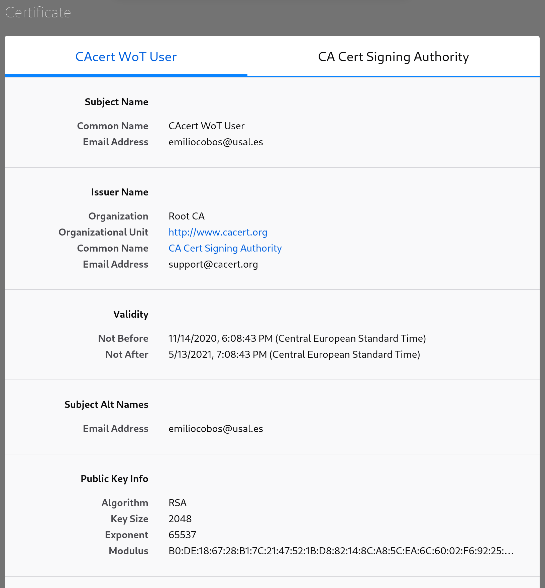
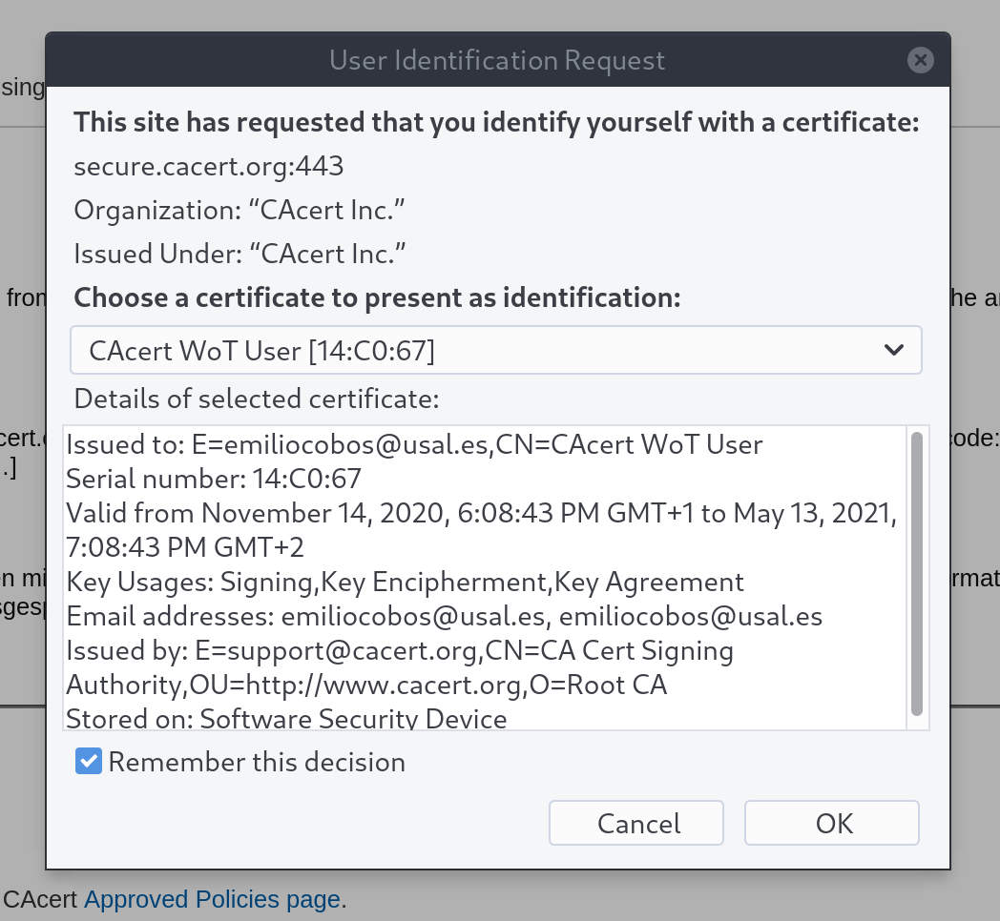

\clearpage

# Obtención de certificados X.509 vía web

Descargamos el certificado raíz de la [página apropiada de
cacert](https://www.cacert.org/index.php?id=3).


Importamos el certificado en nuestro navegador.


Lo importamos en el almacén de Windows:


# Solicitar un certificado digital personal (usuario)


Resulta que cacert.org [no puede generar
certificados](http://bugs.cacert.org/view.php?id=1417) en navegadores modernos
así que tuvimos que usar una versión antigua de Firefox 68 con
[mozregression](https://mozilla.github.io/mozregression/).






\clearpage

## Visualización via openssl

```
$ openssl x509 -text -noout -in emiliocobos@usal.es.crt
Certificate:
    Data:
        Version: 3 (0x2)
        Serial Number: 1359973 (0x14c065)
        Signature Algorithm: sha256WithRSAEncryption
        Issuer: O = Root CA, OU = http://www.cacert.org, CN = CA Cert Signing Authority, emailAddress = support@cacert.org
        Validity
            Not Before: Nov 14 17:00:03 2020 GMT
            Not After : May 13 17:00:03 2021 GMT
        Subject: CN = CAcert WoT User, emailAddress = emiliocobos@usal.es
        Subject Public Key Info:
            Public Key Algorithm: rsaEncryption
                RSA Public-Key: (2048 bit)
                Modulus:
                    00:d0:35:54:7b:21:28:68:b6:a0:99:cb:14:2e:3e:
                    76:f9:53:04:b1:92:9c:af:a1:41:19:ab:08:ab:96:
                    e1:84:cb:88:ee:c5:73:a1:a9:80:34:90:bf:4e:f0:
                    a4:ab:9f:f1:3f:d1:63:1d:6e:c4:2c:65:6c:7f:64:
                    7e:9a:1c:f0:74:ff:57:3b:13:a9:10:7d:57:18:6a:
                    27:4d:b0:b7:24:88:f5:ec:26:6f:98:75:df:59:c1:
                    36:79:81:e7:4a:d9:6d:1d:7e:06:ad:ab:cd:03:05:
                    f5:4a:a3:ce:a5:c0:e6:3f:b7:11:02:4c:1e:45:96:
                    a0:da:5d:5e:98:1b:63:a7:3c:52:93:bd:09:65:d4:
                    bc:dd:9b:4c:ff:5c:13:cc:02:8a:32:1e:a8:76:87:
                    4b:9d:08:53:9b:16:36:02:8f:be:54:a3:29:41:6f:
                    3d:91:74:2f:4d:ae:9b:1b:ed:3b:94:f4:d9:67:3f:
                    61:4b:ca:c6:6f:64:a7:bf:b6:7d:f9:4a:93:87:04:
                    2e:3d:ca:2c:2b:ff:a1:d4:66:49:de:ff:37:0d:b9:
                    a9:bc:89:34:b6:2c:5b:13:1a:84:d3:6a:60:48:d7:
                    54:92:e6:1a:79:21:97:da:57:20:6e:a1:e8:f0:3a:
                    d5:85:3c:04:84:db:f2:f4:63:3b:62:42:04:b4:a8:
                    7a:8b
                Exponent: 65537 (0x10001)
        X509v3 extensions:
            X509v3 Basic Constraints: critical
                CA:FALSE
            Netscape Comment: 
                To get your own certificate for FREE head over to http://www.CAcert.org
            X509v3 Key Usage: critical
                Digital Signature, Key Encipherment, Key Agreement
            X509v3 Extended Key Usage: 
                E-mail Protection, TLS Web Client Authentication, Microsoft Encrypted File System, Microsoft Server Gated Crypto, Netscape Server Gated Crypto
            Authority Information Access: 
                OCSP - URI:http://ocsp.cacert.org

            X509v3 CRL Distribution Points: 

                Full Name:
                  URI:http://crl.cacert.org/revoke.crl

            X509v3 Subject Alternative Name: 
                email:emiliocobos@usal.es
    Signature Algorithm: sha256WithRSAEncryption
         7d:74:2f:f5:58:5c:26:fb:fe:77:33:ad:e1:9a:c2:56:cd:71:
         a7:9d:98:df:41:4f:36:44:3d:13:a5:da:d9:bf:4b:5c:0b:ef:
         ff:1c:2b:60:b9:d8:7e:b1:a7:1b:8d:da:9c:96:cc:45:0a:09:
         ab:d1:4f:65:73:ca:24:1b:5d:b6:7c:77:3e:0c:ec:6a:4a:63:
         8e:b3:51:bd:74:a6:91:6d:14:15:f5:0a:8c:dc:eb:0c:01:c5:
         61:83:11:87:ab:bd:0f:34:c7:7a:55:ce:e0:e1:06:fd:88:5c:
         85:03:8b:87:1a:e7:d3:72:74:3b:3c:7d:b0:38:50:b0:a5:b3:
         5e:2a:64:f5:3b:0a:98:a2:d1:dc:ba:d1:46:1a:0e:5c:01:e6:
         f6:26:42:a4:43:89:ca:5b:90:af:88:02:86:fb:a0:c0:e9:9d:
         a7:7d:bf:59:11:f7:71:cb:6c:9e:49:a1:27:77:e1:7c:d7:a3:
         f6:2d:f5:48:33:d4:9e:eb:21:50:94:9c:28:70:36:27:13:ca:
         62:6e:64:45:4e:27:db:96:6c:21:75:f0:3b:d0:3d:88:42:33:
         dd:7d:53:c3:ee:06:58:dc:8d:c1:2f:ab:f1:23:7e:d7:9e:5b:
         67:63:6e:17:ff:28:7a:85:b0:60:05:ef:75:a5:07:ed:ff:4d:
         c2:72:f7:5a:12:b0:1f:39:cc:e7:0e:db:ed:a3:6b:fa:37:df:
         61:e9:58:28:19:2a:c4:68:76:35:3f:b8:24:7d:21:6a:28:98:
         7e:88:d8:9e:d6:99:22:b7:14:0c:6f:df:29:28:83:df:7b:79:
         01:db:46:94:bb:e5:03:08:80:9b:b8:4e:c5:a2:e8:87:2d:59:
         52:a3:7d:89:71:ed:c9:9f:74:12:09:b9:94:7c:70:c7:0c:9a:
         f3:63:d1:76:7b:57:ca:db:a3:67:c5:19:2a:c0:dd:3f:03:f2:
         47:37:8f:cc:9f:44:82:56:79:5e:19:44:b0:06:76:3b:ac:f9:
         28:71:31:96:c4:1e:f3:ce:3a:d3:a0:29:2b:dd:0c:01:1e:21:
         2e:2d:27:42:06:d6:09:eb:24:6e:07:e4:b1:cb:46:0f:b3:05:
         f9:ea:b6:98:b6:d0:0b:09:f9:13:b5:c8:3d:fc:19:7d:ea:6a:
         9f:5d:e3:ec:b9:a8:14:b6:05:a2:b5:5b:ef:3f:df:04:18:ce:
         e6:e9:77:e4:70:32:ee:b9:80:db:6e:98:d5:a4:61:54:11:cb:
         ba:27:89:f0:ec:cc:ed:cd:e3:62:ce:c4:c7:e2:c6:87:a0:0f:
         a2:45:4d:2b:1b:b4:f7:cc:fd:f7:30:d5:07:3b:bf:9e:bd:44:
         d9:a5:03:4e:f7:f4:b9:cb
```

## CSR

```
$ openssl genrsa -out emiliocobos@usal.es.key 2048
Generating RSA private key, 2048 bit long modulus (2 primes)
..........+++++
................................................................+++++
e is 65537 (0x010001)

$ openssl req -new -key emiliocobos@usal.es.key -out emiliocobos@usal.es.csr
You are about to be asked to enter information that will be incorporated
into your certificate request.
What you are about to enter is what is called a Distinguished Name or a DN.
There are quite a few fields but you can leave some blank
For some fields there will be a default value,
If you enter '.', the field will be left blank.
-----
Country Name (2 letter code) [XX]:ES
State or Province Name (full name) []:Salamanca
Locality Name (eg, city) [Default City]:Salamanca
Organization Name (eg, company) [Default Company Ltd]:.
Organizational Unit Name (eg, section) []:.
Common Name (eg, your name or your server's hostname) []:cacert.crisal.io
Email Address []:emiliocobos@usal.es

Please enter the following 'extra' attributes
to be sent with your certificate request
A challenge password []:[snip :^)]
An optional company name []:.
```

Generamos otro certificado en cacert, poniendo el csr en las opciones avanzadas,
nos descargamos el .pem, y exportamos el fichero p12:

```
$ openssl pkcs12 -export -in emiliocobos@usal.es.csr.crt \
          -name emiliocobos@usal.es -inkey emiliocobos@usal.es.key \
          -passin pass:<snip> \
          -out emiliocobos@usal.es.csr.p12 \
          -passout pass:<snip>
```

Y comprobamos que nuestro navegador lo importa sin problemas.


\clearpage

# Firma y cifrado de mensajes de correo electrónico


