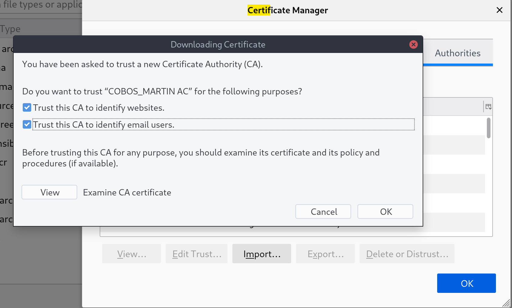
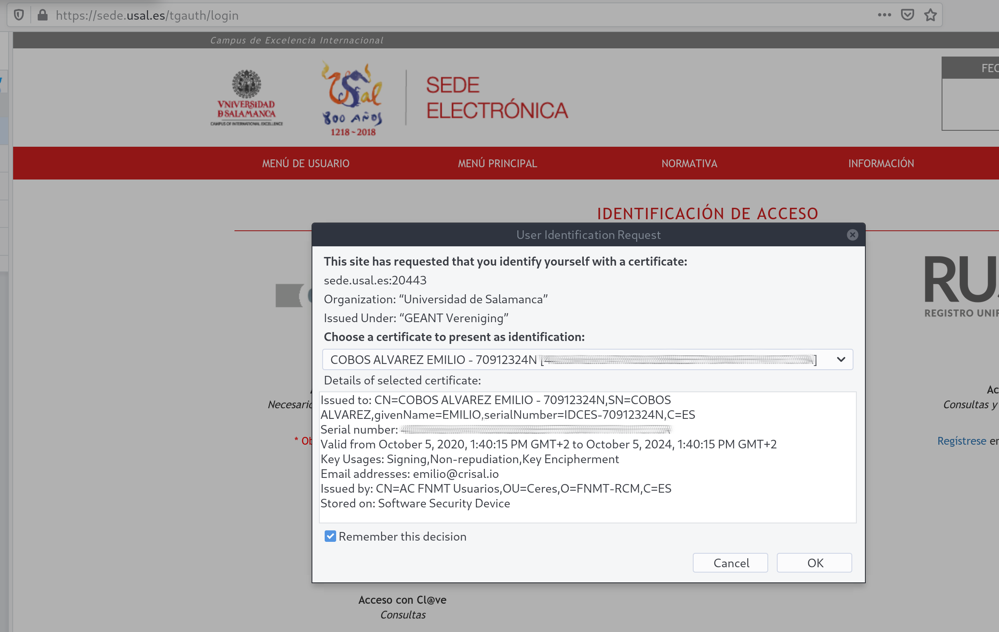
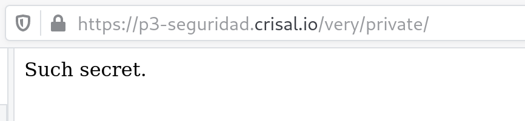
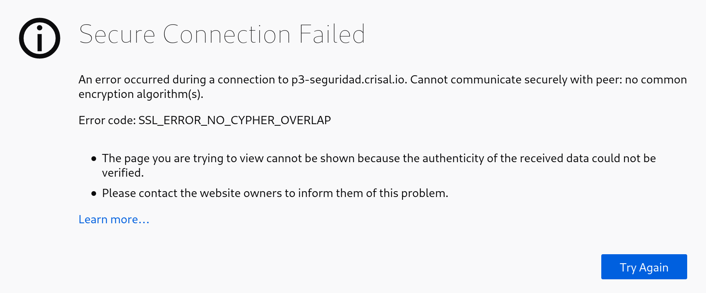
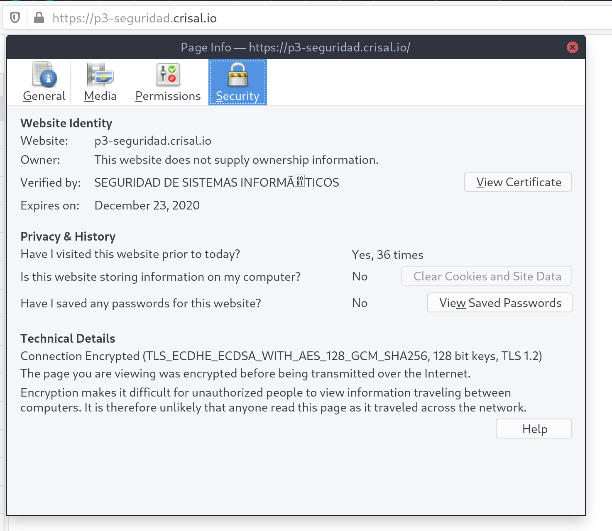

# Generación de clave y certificado para el CA

```
$ openssl req -newkey rsa:2048 \
          -nodes -keyout key.pem \
          -x509 -days 365 \
          -out certificate.pem
Generating a 2048 bit RSA private key
writing new private key to 'key.pem'
-----
You are about to be asked to enter information that will be incorporated
into your certificate request.
What you are about to enter is what is called a Distinguished Name or a DN.
There are quite a few fields but you can leave some blank
For some fields there will be a default value,
If you enter '.', the field will be left blank.
-----
Country Name (2 letter code) [AU]:ES
State or Province Name (full name) [Some-State]:Salamanca
Locality Name (eg, city) []:Salamanca
Organization Name (eg, company) [Internet Widgits Pty Ltd]:SEGURIDAD DE SISTEMAS INFORMÁTICOS
Organizational Unit Name (eg, section) []:Practica 3 2020-2021
Common Name (e.g. server FQDN or YOUR name) []:COBOS_MARTIN AC
Email Address []:emilio@crisal.io
```

# Generación de las claves, CSR, y certificado para el sitio

```
$ # En otro directorio...
$ openssl genrsa -out key.pem 1024
Generating RSA private key, 1024 bit long modulus
e is 65537 (0x010001)
$ openssl req -new -key key.pem -out key.csr
You are about to be asked to enter information that will be incorporated
into your certificate request.
What you are about to enter is what is called a Distinguished Name or a DN.
There are quite a few fields but you can leave some blank
For some fields there will be a default value,
If you enter '.', the field will be left blank.
-----
Country Name (2 letter code) [AU]:ES
State or Province Name (full name) [Some-State]:Salamanca
Locality Name (eg, city) []:Salamanca
Organization Name (eg, company) [Internet Widgits Pty Ltd]:Nobody Ltd
Organizational Unit Name (eg, section) []:
Common Name (e.g. server FQDN or YOUR name) []:p3-seguridad.crisal.io
Email Address []:emilio@crisal.io

Please enter the following 'extra' attributes
to be sent with your certificate request
A challenge password []:
An optional company name []:
```

## Firma del certificado del sitio

```
$ openssl x509 -CA \
      ca/certificate.pem \
      -CAkey ca/key.pem \
      -req -in site/key.csr \
      -CAcreateserial -sha1 \
      -out site/cert.pem
Signature ok
subject=C = ES, ST = Salamanca, L = Salamanca, O = Nobody Ltd, CN = p3-seguridad.crisal.io, emailAddress = emilio@crisal.io
Getting CA Private Key
```

# Certificados personales

## Creación de clave y CSR

(Se repiten los mismos pasos con Juan Carlos y Emilio, por lo que sólo hemos
incluido uno de los dos).

```
$ openssl genrsa -out key.pem 4096
Generating RSA private key, 4096 bit long modulus
........................................++
..........................................................................................................................++
e is 65537 (0x010001
$ openssl req -new -key key.pem -out key.csr
You are about to be asked to enter information that will be incorporated
into your certificate request.
What you are about to enter is what is called a Distinguished Name or a DN.
There are quite a few fields but you can leave some blank
For some fields there will be a default value,
If you enter '.', the field will be left blank.
-----
Country Name (2 letter code) [AU]:ES
State or Province Name (full name) [Some-State]:Salamanca
Locality Name (eg, city) []:Salamanca
Organization Name (eg, company) [Internet Widgits Pty Ltd]:.
Organizational Unit Name (eg, section) []:
Common Name (e.g. server FQDN or YOUR name) []:70882826T
Email Address []:jcmg@usal.es

Please enter the following 'extra' attributes
to be sent with your certificate request
A challenge password []:
An optional company name []:
```

## Firma de la autoridad de certificación

```
$ openssl x509 -CA ca/certificate.pem \
               -CAkey ca/key.pem \
               -req -in jc/key.csr \
               -CAcreateserial -sha1 \
               -out jc/certificate.pem
Signature ok
subject=C = ES, ST = Salamanca, L = Salamanca, CN = 70882826T, emailAddress = jcmg@usal.es
Getting CA Private Key
$ openssl x509 -CA ca/certificate.pem \
               -CAkey ca/key.pem \
               -req -in emilio/key.csr \
               -CAcreateserial -sha1 \
               -out emilio/certificate.pem
Signature ok
subject=C = ES, ST = Salamanca, L = Salamanca, CN = 70912324N, emailAddress = emiliocobos@usal.es
Getting CA Private Key
```

## Exportación como fichero P12

```
$ openssl pkcs12 -inkey key.pem -in certificate.pem -export -out certificate.p12
Enter Export Password:
Verifying - Enter Export Password:
```

# Configuración del servidor web

Hemos usado el [`mod_ssl` de
Apache](https://httpd.apache.org/docs/2.4/mod/mod_ssl.html) para configurar el
acceso via SSL al sitio. El VirtualHost relevante para el acceso seguro al sitio
es el segundo (puerto `443`).

```
$ cat /etc/apache2/sites-available/p3-seguridad.crisal.io.conf
<VirtualHost *:80>
  ServerName p3-seguridad.crisal.io
  ServerAdmin emilio@crisal.io

  DocumentRoot /var/www/vhosts/p3-seguridad.crisal.io/public

  ErrorLog ${APACHE_LOG_DIR}/error.log
  CustomLog ${APACHE_LOG_DIR}/access.log combined
</VirtualHost>

<VirtualHost *:443>
  ServerName p3-seguridad.crisal.io
  ServerAdmin emilio@crisal.io

  DocumentRoot /var/www/vhosts/p3-seguridad.crisal.io/public

  ErrorLog ${APACHE_LOG_DIR}/error.log
  CustomLog ${APACHE_LOG_DIR}/access.log combined

  SSLEngine on
  SSLCertificateFile /var/www/vhosts/p3-seguridad.crisal.io/site/cert.pem
  SSLCertificateKeyFile /var/www/vhosts/p3-seguridad.crisal.io/site/key.pem
</VirtualHost>
```


Descargamos el [certificado de la autoridad de
certificación](https://p3-seguridad.crisal.io/ca/certificate.pem), y lo
importamos en nuestro navegador, tras lo cual conseguimos que Firefox considere
nuestra página segura.




# Acceso a sitio web con certificado personal

Emilio va a acceder a la [sede de la USAL](https://sede.usal.es/tgauth/login)
usando su certificado de la FNMT.



## ¿Cómo?

Para autenticarse con un certificado personal, se utilizan lo que se llama *SSL
Client Authentication* o *SSL Client Certificates*. Básicamente se trata de
configurar el servidor de tal manera que el cliente también se tenga que
autenticar usando un certificado.

Existe documentación de Apache acerca de cómo configurarlo [en su sitio
web](http://httpd.apache.org/docs/2.0/ssl/ssl_howto.html#allclients).

Cuando el cliente está autenticado, el servidor puede pasar [variables de
entorno](https://httpd.apache.org/docs/2.4/mod/mod_ssl.html#envvars) a la
aplicación acerca del certificado como `SSL_CLIENT_VERIFY` o las otras variables
`SSL_CLIENT_*` que se pueden utilizar para saber quién es el usuario. Por
ejemplo, nuestro servidor lo ha habilitado con `SSLOptions +StdEnvVars
+ExportCertData`, y puedes ver las variables en
[/very/private/env.php](https://p3-seguridad.crisal.io/very/private/env.php)
([código fuente](https://p3-seguridad.crisal.io/very/private/env.php?source)).

También se puede hacer filtrado con
[`SSLRequire`](https://httpd.apache.org/docs/2.4/mod/mod_ssl.html#SSLRequire),
o usar [`SSLUserName`](https://httpd.apache.org/docs/2.4/mod/mod_ssl.html#sslusername)
a uno de los campos para configurar la variable `REMOTE_USER` (algo más limitado
que `+StdEnvVars`, etc, pero probablemente más rápido.

Podríamos requerir autenticación usando nuestro CA con algo como:

```
SSLCACertificateFile /var/www/vhosts/p3-seguridad.crisal.io/ca/certificate.pem
SSLVerifyClient none
<Location /very/private>
  SSLVerifyClient require
</Location>
```

En nuestra configuración de Apache. Esto permite usar certificados firmados por
nuestro propio CA.




Podríamos usar algo como el [certificado raíz de la
FNMT](https://www.sede.fnmt.gob.es/en/descargas/certificados-raiz-de-la-fnmt) en
vez de eso, por ejemplo.

Podemos permitir autenticarse con ambos tal que así:

```
$ wget https://www.sede.fnmt.gob.es/documents/10445900/10526749/AC_Raiz_FNMT-RCM_SHA256.cer
$ # Convertir el certificado a PEM
$ openssl x509 -inform DER -in AC_Raiz_FNMT-RCM_SHA256.cer -out fnmt.pem
$ cat fnmt/fnmt.pem ca/certificate.pem > very/private/certificates.pem
```

Y apuntando nuestra configuración al fichero con ambos certificados. También
tenemos que aumentar la longitud de la cadena de verificación máxima para evitar
errores como:

> AH02040: Certificate Verification: Certificate Chain too long (chain has
> 2 certificates, but maximum allowed are only 1)

Por lo tanto, nuestra configuración final quedará como:

```
SSLVerifyClient none
SSLCACertificateFile /var/www/vhosts/p3-seguridad.crisal.io/very/private/certificates.pem
SSLVerifyDepth 5
<Location /very/private>
        SSLVerifyClient require
</Location>
```

De hecho (asumiendo que no ha pasado demasiado tiempo desde que esto se ha
escrito), puedes autenticarte usando un certificado personal de la FNMT para
acceder a `https://p3-seguridad.crisal.io/very/private`.

Nuestro directorio por lo tanto queda con los ficheros tal que así:

```
.
├── ca
│   ├── certificate.pem
│   ├── certificate.srl
│   └── key.pem
├── emilio
│   ├── certificate.p12
│   ├── certificate.pem
│   ├── key.csr
│   └── key.pem
├── fnmt
│   ├── AC_Raiz_FNMT-RCM_SHA256.cer
│   └── fnmt.pem
├── jc
│   ├── certificate.p12
│   ├── certificate.pem
│   ├── key.csr
│   └── key.pem
├── public
│   └── index.html
├── site
│   ├── cert.pem
│   ├── key.csr
│   └── key.pem
└── very
    └── private
        ├── certificates.pem
        └── index.html
```

Todos los ficheros se han hecho públicos como demostración, pero obviamente para
cualquier uso serio sólo el directorio `public` y los directorios autenticados
se harían públicos.

## Configuración final de Apache

Nuestra configuración final de Apache quedaría así:

```
$ cat /etc/apache2/sites-available/p3-seguridad.crisal.io.conf
<VirtualHost *:80>
  ServerName p3-seguridad.crisal.io
  ServerAdmin emilio@crisal.io

  DocumentRoot /var/www/vhosts/p3-seguridad.crisal.io

  ErrorLog ${APACHE_LOG_DIR}/error.log
  CustomLog ${APACHE_LOG_DIR}/access.log combined

  # private area should only be accessible via SSL
  RewriteEngine on
  RewriteCond %{SERVER_NAME} =p3-seguridad.crisal.io
  RewriteCond %{REQUEST_URI} ^/very/private
  RewriteRule ^ https://%{SERVER_NAME}%{REQUEST_URI} [END,QSA,R=permanent]
</VirtualHost>

<VirtualHost *:443>
  ServerName p3-seguridad.crisal.io
  ServerAdmin emilio@crisal.io

  DocumentRoot /var/www/vhosts/p3-seguridad.crisal.io

  ErrorLog ${APACHE_LOG_DIR}/error.log
  CustomLog ${APACHE_LOG_DIR}/access.log combined

  SSLEngine on
  SSLOptions +StdEnvVars +ExportCertData
  SSLCertificateFile /var/www/vhosts/p3-seguridad.crisal.io/site/cert.pem
  SSLCertificateKeyFile /var/www/vhosts/p3-seguridad.crisal.io/site/key.pem

  SSLVerifyClient none
  SSLCACertificateFile /var/www/vhosts/p3-seguridad.crisal.io/very/private/certificates.pem
  SSLVerifyDepth 5
  <Location /very/private>
    SSLVerifyClient require
  </Location>
</VirtualHost>
```

## Bonus

Como pequeño bonus extra, reportamos un
[bug](https://bugzilla.mozilla.org/show_bug.cgi?id=1678959) a Firefox acerca de
su habilidad para recordar decisiones de autenticación (y tal vez Emilio lo
arregle, ya veremos).

# Creación de certificados personales usando ECC

Crear los certificados del punto anterior pero usando curvas elípticas es
relativamente sencillo. Lo único que cambia es literalmente el comando para
crear la clave inicialmente. Tenemos que usar el [comando `ecparam` de
openssl](https://www.openssl.org/docs/man1.0.2/man1/ecparam.html) para generar
claves.

Podemos usar `-list_curves` para ver todas las curvas disponibles:

```
$ openssl ecparam -list_curves
  secp112r1 : SECG/WTLS curve over a 112 bit prime field
  secp112r2 : SECG curve over a 112 bit prime field
  secp128r1 : SECG curve over a 128 bit prime field
  secp128r2 : SECG curve over a 128 bit prime field
  secp160k1 : SECG curve over a 160 bit prime field
  secp160r1 : SECG curve over a 160 bit prime field
  secp160r2 : SECG/WTLS curve over a 160 bit prime field
  secp192k1 : SECG curve over a 192 bit prime field
  secp224k1 : SECG curve over a 224 bit prime field
  secp224r1 : NIST/SECG curve over a 224 bit prime field
  secp256k1 : SECG curve over a 256 bit prime field
  secp384r1 : NIST/SECG curve over a 384 bit prime field
  secp521r1 : NIST/SECG curve over a 521 bit prime field
  prime192v1: NIST/X9.62/SECG curve over a 192 bit prime field
  prime192v2: X9.62 curve over a 192 bit prime field
  prime192v3: X9.62 curve over a 192 bit prime field
  prime239v1: X9.62 curve over a 239 bit prime field
  prime239v2: X9.62 curve over a 239 bit prime field
  prime239v3: X9.62 curve over a 239 bit prime field
  prime256v1: X9.62/SECG curve over a 256 bit prime field
  sect113r1 : SECG curve over a 113 bit binary field
  sect113r2 : SECG curve over a 113 bit binary field
  sect131r1 : SECG/WTLS curve over a 131 bit binary field
  sect131r2 : SECG curve over a 131 bit binary field
  sect163k1 : NIST/SECG/WTLS curve over a 163 bit binary field
  sect163r1 : SECG curve over a 163 bit binary field
  sect163r2 : NIST/SECG curve over a 163 bit binary field
  sect193r1 : SECG curve over a 193 bit binary field
  sect193r2 : SECG curve over a 193 bit binary field
  sect233k1 : NIST/SECG/WTLS curve over a 233 bit binary field
  sect233r1 : NIST/SECG/WTLS curve over a 233 bit binary field
  sect239k1 : SECG curve over a 239 bit binary field
  sect283k1 : NIST/SECG curve over a 283 bit binary field
  sect283r1 : NIST/SECG curve over a 283 bit binary field
  sect409k1 : NIST/SECG curve over a 409 bit binary field
  sect409r1 : NIST/SECG curve over a 409 bit binary field
  sect571k1 : NIST/SECG curve over a 571 bit binary field
  sect571r1 : NIST/SECG curve over a 571 bit binary field
  c2pnb163v1: X9.62 curve over a 163 bit binary field
  c2pnb163v2: X9.62 curve over a 163 bit binary field
  c2pnb163v3: X9.62 curve over a 163 bit binary field
  c2pnb176v1: X9.62 curve over a 176 bit binary field
  c2tnb191v1: X9.62 curve over a 191 bit binary field
  c2tnb191v2: X9.62 curve over a 191 bit binary field
  c2tnb191v3: X9.62 curve over a 191 bit binary field
  c2pnb208w1: X9.62 curve over a 208 bit binary field
  c2tnb239v1: X9.62 curve over a 239 bit binary field
  c2tnb239v2: X9.62 curve over a 239 bit binary field
  c2tnb239v3: X9.62 curve over a 239 bit binary field
  c2pnb272w1: X9.62 curve over a 272 bit binary field
  c2pnb304w1: X9.62 curve over a 304 bit binary field
  c2tnb359v1: X9.62 curve over a 359 bit binary field
  c2pnb368w1: X9.62 curve over a 368 bit binary field
  c2tnb431r1: X9.62 curve over a 431 bit binary field
  wap-wsg-idm-ecid-wtls1: WTLS curve over a 113 bit binary field
  wap-wsg-idm-ecid-wtls3: NIST/SECG/WTLS curve over a 163 bit binary field
  wap-wsg-idm-ecid-wtls4: SECG curve over a 113 bit binary field
  wap-wsg-idm-ecid-wtls5: X9.62 curve over a 163 bit binary field
  wap-wsg-idm-ecid-wtls6: SECG/WTLS curve over a 112 bit prime field
  wap-wsg-idm-ecid-wtls7: SECG/WTLS curve over a 160 bit prime field
  wap-wsg-idm-ecid-wtls8: WTLS curve over a 112 bit prime field
  wap-wsg-idm-ecid-wtls9: WTLS curve over a 160 bit prime field
  wap-wsg-idm-ecid-wtls10: NIST/SECG/WTLS curve over a 233 bit binary field
  wap-wsg-idm-ecid-wtls11: NIST/SECG/WTLS curve over a 233 bit binary field
  wap-wsg-idm-ecid-wtls12: WTLS curve over a 224 bit prime field
  Oakley-EC2N-3:
	IPSec/IKE/Oakley curve #3 over a 155 bit binary field.
	Not suitable for ECDSA.
	Questionable extension field!
  Oakley-EC2N-4:
	IPSec/IKE/Oakley curve #4 over a 185 bit binary field.
	Not suitable for ECDSA.
	Questionable extension field!
  brainpoolP160r1: RFC 5639 curve over a 160 bit prime field
  brainpoolP160t1: RFC 5639 curve over a 160 bit prime field
  brainpoolP192r1: RFC 5639 curve over a 192 bit prime field
  brainpoolP192t1: RFC 5639 curve over a 192 bit prime field
  brainpoolP224r1: RFC 5639 curve over a 224 bit prime field
  brainpoolP224t1: RFC 5639 curve over a 224 bit prime field
  brainpoolP256r1: RFC 5639 curve over a 256 bit prime field
  brainpoolP256t1: RFC 5639 curve over a 256 bit prime field
  brainpoolP320r1: RFC 5639 curve over a 320 bit prime field
  brainpoolP320t1: RFC 5639 curve over a 320 bit prime field
  brainpoolP384r1: RFC 5639 curve over a 384 bit prime field
  brainpoolP384t1: RFC 5639 curve over a 384 bit prime field
  brainpoolP512r1: RFC 5639 curve over a 512 bit prime field
  brainpoolP512t1: RFC 5639 curve over a 512 bit prime field
```

Como la única restricción del enunciado es que sea una clave de 160 bits, hemos
usado `brainpoolP160t1` aleatoriamente. Hemos usado el directorio `site/ecc`
para almacenar las claves.

```
$ openssl ecparam -genkey -name brainpoolP160t1 -out key.pem
$ openssl req -new -key key.pem -out key.csr
You are about to be asked to enter information that will be incorporated
into your certificate request.
What you are about to enter is what is called a Distinguished Name or a DN.
There are quite a few fields but you can leave some blank
For some fields there will be a default value,
If you enter '.', the field will be left blank.
-----
Country Name (2 letter code) [AU]:ES
State or Province Name (full name) [Some-State]:Salamanca
Locality Name (eg, city) []:Salamanca
Organization Name (eg, company) [Internet Widgits Pty Ltd]:.
Organizational Unit Name (eg, section) []:
Common Name (e.g. server FQDN or YOUR name) []:p3-seguridad.crisal.io
Email Address []:emilio@crisal.io

Please enter the following 'extra' attributes
to be sent with your certificate request
A challenge password []:
An optional company name []:
$ openssl x509 -CA ca/certificate.pem \
               -CAkey ca/key.pem \
               -req -in site/ecc/key.csr \
               -CAcreateserial -sha1 \
               -out site/ecc/certificate.pem
Signature ok
subject=C = ES, ST = Salamanca, L = Salamanca, CN = p3-seguridad.crisal.io, emailAddress = emilio@crisal.io
Getting CA Private Key
```

Apuntando la configuración de Apache a nuestro nuevo certificado, obtenemos un
error:



Este error es porque el cliente (nuestro navegador en este caso) no tiene el
cifrado necesario disponible. Eso es porque en Fedora muchas de estas curvas
elípticas no existen, [por motivos
legales](https://bugzilla.redhat.com/show_bug.cgi?id=1405843#c1).

Hay algunos [hilos
recientes](https://lists.fedoraproject.org/archives/list/legal@lists.fedoraproject.org/thread/WUQNAB4EPWSJMMVECL2TZGKB5KIDESII/)
(10 de Noviembre de 2020) para añadir soporte para la curva Brainpool que hemos
usado, así que con suerte funcionará dentro de poco.

Mientras tanto, hemos generado otro certificado con una de las curvas que sí
están disponibles en Fedora como `prime256v1`, y lo hemos usado
satisfactoriamente para acceder al sitio web.


