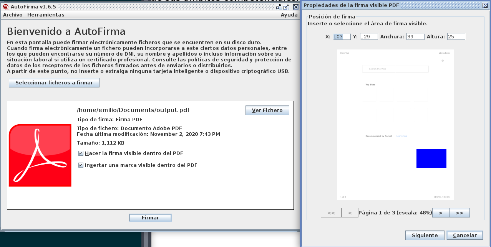

# Tipos de firma electrónica

El Portal de Administración Electrónica contiene [información bastante
extensa](https://firmaelectronica.gob.es/Home/Ciudadanos/Base-Legal.html) al
respecto.

La legislación básica sobre firma electrónica se recoge en la Ley 59/2003, de 19
de diciembre, de Firma Electrónica.

> *Art. 3.1)* La firma electrónica es el conjunto de datos en forma electrónica,
> consignados junto a otros o asociados con ellos, que pueden ser utilizados
> como medio de identificación del firmante.

La Ley distingue entre dos tipos de firma, la *firma electrónica avanzada* y la
*firma electrónica reconocida*.

## Firma electrónica avanzada

La misma ley recoge la definición de *firma electrónica avanzada*:

> *Art. 3.2)* La firma electrónica avanzada es la firma electrónica que permite
> identificar al firmante y detectar cualquier cambio ulterior de los datos
> firmados, que está vinculada al firmante de manera única y a los datos a que
> se refiere y que ha sido creada por medios que el firmante puede mantener bajo
> su exclusivo control.

Aunque internacionalmente es la ley Europea número 910/2014
[*eIDAS*](https://en.wikipedia.org/wiki/EIDAS) la que recoge los requisitos.

Hay varios tipos de implementación que cumplen esos requisitos, generalmente
basados en los *Ades Baseline Profiles* desarrollados por el
[ETSI](https://en.wikipedia.org/wiki/ETSI).

Los varios estándares discutidos aquí se pueden descargar desde [la web de
ETSI](https://www.etsi.org/standards).

### XAdES

XAdES, *XML Advanced Electronic Signatures*, son unas extensiones
a [XML-DSig](https://www.w3.org/TR/xmldsig-core/) que las hacen adecuadas para
firmas electrónicas avanzadas.

Hay varios tipos de perfiles en XAdES, con diferentes tipos de protección:

 * **XAdES-BES** (*Basic Electronic Signatures*, firmas electrónicas básicas):
   sólo satisface los requerimientos establecidos por la Directiva Europea.

 * **XAdES-T** (*Timestamp*): añade un sellado de tiempo para identificar cuando
   se firmó el documento, y proteger contra el repudio.

 * **XAdES-C** (*Complete*): cuenta con un conjunto de referencias a los
   certificados de la cadena de certificación y su estado sirve como base para
   una verificación duradera, pero no almacena los datos como tal.

 * **XAdES-X** (*eXtended*): Se añaden sellos de tiempo a las referencias
   introducidas en AdES–C, para proteger contra compromisos en la cadena de
   certificados en el futuro.

 * **XAdES-XL** (*eXtended Long-term*): Se añade los certificados para permitir
   la validación del documento en el futuro.

 * **XAdES-A** (*Archival*): permite añadir sellos de tiempo periódicos al
   documento para combatir el deterioro de la firma durante un periodo de tiempo
   amplio (si el algoritmo criptográfico en uso fuera roto, por ejemplo).

### PAdES

PAdES (*PDF Advanced Electronic Signatures*) es una serie de restricciones
y extensiones al formato PDF haciéndolo viable para firmas avanzadas.

Tiene varios niveles de verificación para un certificado digital, desde el más
básico (b-b, indicando que se ha realizado una firma con un certificado válido
en una fecha particular) al más complejo (b-LTV, *Long Term Validity*),
permitiendo que los documentos firmados electrónicamente se mantengan siendo
válidos por largos periodos de tiempo, incluso si los certificados o algoritmos
criptográficos expiraran.

### CAdES

CAdES (*CMS Advanced Electronic Signatures*) son una serie de extensiones a [CMS
(*Cryptographic Message Syntax*)](https://tools.ietf.org/html/rfc5652).

Tiene cuatro perfiles diferentes:

 * **CAdES-B**: Sólo satisface los requerimientos establecidos por la Directiva
   Europea.
 * **CAdES-T**: Es equivalente a CAdES-B, pero con un *Trusted Service Provider*
   proporcionando un token que prueba que la firma existió en una determinada
   fecha.
 * **CAdES-LT**: Se incorpora a CAdES-LT los certificados usados para validar la
   firma.
 * **CAdES-LTA**: CAdES-LT, más firma periódica, como *XAdES-A*.


## Firma electrónica reconocida

> Art. 3.3) Se considera firma electrónica reconocida la firma electrónica
> avanzada basada en un certificado reconocido y generada mediante un
> dispositivo seguro de creación de firma.

Es decir, hay dos requisitos extra.

### "Basada en un certificado reconocido"

El certificado debe haber sido reconocido por el Ministerio de Industria
y Comercio como habilitado para crear firmas reconocidas y debe estar listado en
[su página web](https://sedeaplicaciones.minetur.gob.es/Prestadores/) como tal.

### "Ser generada con un dispositivo seguro de creación de firma"

Las características de un dispositivo seguro de creación de firma están
recogidas en el artículo 24 de la Ley 59/2003 de Firma Electrónica.

Principalmente, el dispositivo seguro debe garantizar que las claves sean únicas
y secretas, que la clave privada no se puede deducir de la pública y viceversa,
que el firmante pueda proteger de forma fiable las claves, que no se altere el
contenido del documento original y que el firmante pueda ver qué es lo que va
a firmar.

Desde un punto de vista técnico, según el artículo 27 de la Ley 59/2003, un
dispositivo seguro de firma debe ser certificado como que cumple las
características anteriores según las normas técnicas publicadas en la Decisión
2003/511/CE, de 14 de julio de 2003 de la Comisión Europea.

# Aplicaciones

## AutoFirma

AutoFirma es la aplicación de firma electrónica desarrollada por el Ministerio
de Hacienda y Administraciones Públicas.

Al poder ser ejecutada desde el navegador, permite la firma en páginas de
Administración Electrónica cuando se requiere la firma en un procedimiento
administrativo, como la [sede digital de la USAL](https://sede.usal.es).

Está disponible para Windows, GNU/Linux y Mac.

Es software libre con licencia GPL 2+ y EUPL 1.1, hosteado en
[GitHub](https://github.com/ctt-gob-es/clienteafirma).

La interfaz gráfica está desarrollada en Java, y permite firmar documentos
arbitrarios con relativa sencillez.




Podemos verificar la firma con la utilidad `pdfsig`:

```
$ pdfsig output_signed.pdf
Digital Signature Info of: output_signed.pdf
Signature #1:
  - Signer Certificate Common Name: COBOS ALVAREZ EMILIO - 70912324N
  - Signer full Distinguished Name: CN=COBOS ALVAREZ EMILIO - 70912324N,SN=COBOS ALVAREZ,givenName=EMILIO,serialNumber=IDCES-70912324N,C=ES
  - Signing Time: Nov 26 2020 23:10:15
  - Signing Hash Algorithm: SHA-256
  - Signature Type: ETSI.CAdES.detached
  - Signed Ranges: [0 - 107578], [161580 - 1286809]
  - Total document signed
  - Signature Validation: Signature is Valid.
  - Certificate Validation: Certificate issuer isn't Trusted.
```

Así podemos ver que AutoFirma utiliza CAdES por defecto.

AutoFirma también proporciona una herramienta CLI con más opciones para la firma
de documentos, como elección de formato, etc...

```
$ autofirma sign -help
Sintaxis: AutoFirma sign [options...]

options

  -gui			 (Realiza la operacion con entorno grafico. Tiene prioridad sobre -certgui)
  -certgui		 (Usa un dialogo grafico para la seleccion del certificado de firma)
  -i inputfile		 (Ruta del fichero de entrada)
  -o outputfile		 (Ruta del fichero de salida)
  -algorithm algo	 (Algoritmo de firma)
  -format		 (Establece el formato de firma)
  	 auto		 (Seleccion de formato en base al fichero de entrada)
  	 cades		 (Formato CAdES)
  	 pades		 (Formato PAdES)
  	 xades		 (Formato XAdES)
  	 facturae	 (Firma de factura electronica)
  	 ooxml		 (Formato OOXML)
  	 odf		 (Formato ODF)
  -config extraParams	 (Properties en texto plano con la configuracion de la operacion)
  -store		 (Establece el almacen de claves. Por defecto, el del sistema)
  	 auto		 (Almacen de claves del sistema)
  	 windows	 (Almacen de claves de Windows)
  	 mac		 (Almacen de claves de Mac OS X)
  	 mozilla	 (Almacen de claves de Mozilla Firefox)
  	 dni		 (DNI electronico)
  	 pkcs12:p12file	 (Almacen PKCS#12. "p12file" es la ruta del almacen)
  	 pkcs11:p11file	 (Almacen PKCS#11. "p11file" es la ruta del controlador)
  -password password	 (Establece la contrasena del almacen)
  -alias alias		 (Alias del certificado de firma)
  -filter filter	 (Filtro para seleccionar el certificado de firma)
  -xml			 (Formatea la respuesta como XML)
```

De hecho, podemos verificar nuestra firma previa con `AutoFirma` en vez de
`pdfsig`, que abre el visor.


## LibreOffice

LibreOffice es una suite de ofimática libre y multiplataforma. Las versiones
modernas de LibreOffice tienen opción de firmar y verificar firmas de PDFs
también.


Podemos hacer click en el botón de firma y elegir un certificado del almacén de
Firefox.


Podemos verificar el documento con `AutoFirma` o `pdfsig`, o ver las firmas en
`libreoffice` de la misma manera que anteriormente.

## VALIDe

Valide es una aplicación web que permite validar y generar firmas digitales,
entre otras cosas.

Hemos creado un documento firmado y validado, y el servicio de firma parece un
simple front-end de `AutoFirma`, por lo que no resulta tan útil si sabes usar
`AutoFirma`.


Sin embargo, con respecto a la verificación de documentos, tener un sistema
central donde un documento se pueda verificar parece útil.

Dicho eso, es probable que no tenga una acogida demasiado grande por el hecho de
que la aplicación requiere subir un documento con información potencialmente
sensible a una página web gubernamental.


## XolidoSign

Es un software de la empresa Xolido que permite:

 * Realizar firmas electrónicas de documentos
 * Aplicar sellos de tiempo.
 * Verificar firmas electrónicas, sellos de tiempo y ficheros firmados.

Xolido puede trabajar con distintos tipos de archivos y extensiones sin límite
de tamaño es compatible con DNIe y el certificado de empleo público o de
empresa.

No hemos experimentado con esta aplicación ya que no está disponible para
sistemas GNU/Linux.

## Acrobat de Adobe Systems

El lector / visor de PDF por excelencia en Windows / Mac, tampoco disponible en
GNU/Linux.

# Generar y comprobar una firma PGP

En prácticas anteriores ya hemos hecho esto. Dicho eso, comprobaremos un digest
de openssl usando GnuPG por las jajas.

Accediendo a la [página de la release
1.1.1](https://www.openssl.org/source/old/1.1.1), podemos ver que la última de
esas releases se hostea en
`https://www.openssl.org/source/old/1.1.1/openssl-1.1.1g.tar.gz`, y su firma
PGP en `https://www.openssl.org/source/old/1.1.1/openssl-1.1.1g.tar.gz.asc`.

También hay varios hashes (SHA1, SHA256) que también verificaremos.

```
$ for ext in "" ".asc" ".sha1" ".sha256"; do
  wget https://www.openssl.org/source/old/1.1.1/openssl-1.1.1g.tar.gz$ext
done
```

Vamos a verificar el archivo con GnuPG primero...

```
$ gpg --verify openssl-1.1.1g.tar.gz.asc openssl-1.1.1g.tar.gz
gpg: Signature made Tue 21 Apr 2020 02:22:45 PM CEST
gpg:                using RSA key 8657ABB260F056B1E5190839D9C4D26D0E604491
gpg: Can't check signature: No public key
```

Por supuesto, no tenemos la clave pública de la persona que lo firmó. Desde la
[página de descargas](https://www.openssl.org/source/) podemos ver que las
claves PGP están en la [página del
OMP](https://www.openssl.org/community/omc.html):

> PGP keys for the signatures are available from the OMC
> page. Current members that sign releases include Richard Levitte and Matt
> Caswell.

Podríamos importar ambas claves, pero vemos que el fingerprint de la clave
(`8657ABB260F056B1E5190839D9C4D26D0E604491`) coincide con el de Matt, así que
importaremos esa. Como están en un keyserver público podemos hacer lo siguiente:

```
$ gpg --recv-keys 8657ABB260F056B1E5190839D9C4D26D0E604491
gpg: key D9C4D26D0E604491: public key "Matt Caswell <matt@openssl.org>" imported
gpg: Total number processed: 1
gpg:               imported: 1
```

Con esa clave importada, ahora verificar la firma tendría que funcionar:

```
$ gpg --verify openssl-1.1.1g.tar.gz.asc openssl-1.1.1g.tar.gz
gpg: Signature made Tue 21 Apr 2020 02:22:45 PM CEST
gpg:                using RSA key 8657ABB260F056B1E5190839D9C4D26D0E604491
gpg: Good signature from "Matt Caswell <matt@openssl.org>" [unknown]
gpg:                 aka "Matt Caswell <frodo@baggins.org>" [unknown]
gpg: WARNING: This key is not certified with a trusted signature!
gpg:          There is no indication that the signature belongs to the owner.
Primary key fingerprint: 8657 ABB2 60F0 56B1 E519  0839 D9C4 D26D 0E60 4491
```

Obviamente nos da un warning, porque no hemos marcado esa clave como trusted
previamente (la acabamos de importar).

Sólo para estar extra-seguros, vamos también a verificar los varios checksums:

```
$ sha1sum openssl-1.1.1g.tar.gz
b213a293f2127ec3e323fb3cfc0c9807664fd997  openssl-1.1.1g.tar.gz
$ cat openssl-1.1.1g.tar.gz.sha1
b213a293f2127ec3e323fb3cfc0c9807664fd997
$ sha256sum openssl-1.1.1g.tar.gz
ddb04774f1e32f0c49751e21b67216ac87852ceb056b75209af2443400636d46  openssl-1.1.1g.tar.gz
$ cat openssl-1.1.1g.tar.gz.sha256
ddb04774f1e32f0c49751e21b67216ac87852ceb056b75209af2443400636d46
```

Podemos ver como los hashes coinciden así que tras haber comprobado tanto la
firma como los checksums podemos estar bastante seguros de que tenemos el código
que Matt Caswell subió :^)

# Firmar mensajes y comprobar firmas usando claves de criptomonedas

De este vamos a pasar, porque consideramos Bitcoin una de los mayores riesgos
para el planeta de los últimos años. Bitcoin consume más
[energía](https://digiconomist.net/bitcoin-energy-consumption) que [países
enteros](https://www.theverge.com/2019/7/4/20682109/bitcoin-energy-consumption-annual-calculation-cambridge-index-cbeci-country-comparison)
para realizar transacciones que se pueden realizar de formas alternativas
eficientemente. En general, el 90% de las veces que a alguien le parece bien
usar blockchain para algo, en realidad quiere una base de datos.
