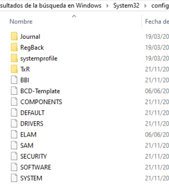

# Diceware

El método *Diceware* consiste en seleccionar una serie de palabras de forma
aleatoria de una lista (*diceware.pdf* en este caso).

Cada palabra de la lista tiene un número de 5 dígitos, todos los dígitos son
números del rango del 1 al 6, por lo que es necesario utilizar 5 tiradas del
dado para elegir una palabra de la lista.

Nuestra frase de paso estará formada por 6 palabras, por lo que hay que lanzar
el dado 30 veces (6 palabras $\times$ 5 dígitos).

Obtenemos los siguientes resultados:

+-------+-------+
| 25423 | q46   |
+-------+-------+
| 25563 | caer  |
+-------+-------+
| 43511 | lende |
+-------+-------+
| 53324 | parte |
+-------+-------+
| 63513 | ti    |
+-------+-------+
| 11666 | 215   |
+-------+-------+

Por lo tanto, nuestra contraseña es *q46caerlendeparteti215*, y nuestra
passphrase es la misma pero con espacios: *q46 caer lende parte ti 215*.

# `/etc/{passwd,shadow}`

En `/etc/passwd` se almacena la información de todos los usuarios que están
dados de alta en el sistema.

El formato es una línea por usuario, y cada línea está compuesta por:

```
username:password:uid:gid:comment:home:shell
```

 * username: El nombre de usuario.
 * password: La contraseña. Si este campo es una `x`, eso indica que está
   cifrada en el fichero `/etc/shadow`.
 * uid: El id del usuario. `0` está reservado para `root`. Los uid de `0`
   a `99` están reservados para otras cuentas predefinidas. Los uid de `100`
   a `999` están reservados para cuentas o grupos del sistema.
 * gid: Id del grupo (la descripción de los grupos se guarda en `/etc/group`).
 * comment: Un comentario donde se puede almacenar cosas como el nombre o una
   descripción del usuario.
 * home: Directorio en el que el usuario se encontrará cuando entre en el
   sistema.
 * shell: El comando que se ejecuta cuando el usuario entra en el sistema de
   forma interactiva. Suele ser una shell (como `bash`, `sh` o `zsh`), pero no
   tiene por qué serlo. De hecho apuntar a un ejecutable como `/sbin/nologin`
   o similar (que cierra la conexión) sirve para asegurarse de que no se pueda
   entrar de forma interactiva como ese usuario.

Como hemos mencionado arriba, en `/etc/shadow` se guardan las contraseñas
encriptadas de los usuarios del sistema.

Este también es una lista con una línea por usuario, con el formato:\

```
username:pass:lastchanged:minlife:maxlife:warn:inactive:expired:
```

 * username: Nombre de usuario
 * pass: Contraseña encriptada. Normalmente el formato de la contraseña es
   `$id$salt$hashed`, donde `id` es el algoritmo (`1` es MD5, `2a` / `2y`
   blowfish, `5` es sha256, `6` es sha512...), `salt` es el salt, y `hashed` es
   la contraseña cifrada con ese algoritmo y salt.
 * lastchanged: Fecha en la que se cambió la contraseña por última vez, en
   número de días desde el 1/1/1970.
 * minlife: Mínimo número de días entre cambios de contraseña.
 * maxlife: Máximo número de días entre cambios de contraseña.
 * warn: Número de días antes de que la contraseña expire desde los que el
   usuario será advertido para cambiar la contraseña.
 * inactive: Número de días desde que la contraseña expire tras los que la
   cuenta se desactivará.
 * expired: Fecha, en días desde el 1/1/1970 en la cual la contraseña expira.

# Contraseñas en Windows

Las contraseñas en el sistema operativo Windows son almacenadas en la base de
datos SAM (*Security Account Manager*).

Esta base de datos guarda las cuentas de los usuarios junto a información de
seguridad para estos que accedan al equipo. La base de datos se ejecuta
automáticamente al igual que un proceso de arranque del sistema.

La ruta está especificada en `%SystemRoot%/system32/config/SAM`.



# Herramientas para romper contraseñas

## Brutus

Brutus es una de las aplicaciones más antiguas para romper contraseñas.
Publicada en el año 2000, esta herramienta es compatible 
y NetBus, entre otros muchos. Además, una de las características más
interesantes de Brutus es que es posible pausar y reanudar los ataques de fuerza
bruta cuando queramos sin tener que empezarlos de cero.


Por defecto, viene configurado para probar una [autenticación simple via
HTTP](https://en.wikipedia.org/wiki/Basic_access_authentication), pero se puede
configurar para hacer un POST a un sitio web por ejemplo, o para autenticarse
con otra gran cantidad de protocolos como HTTP, FTP, POP3, SMB, Telnet, NNTP,
IMAP, ...

En la sección *Authentication Options*, se pueden configurar los diccionarios de
contraseñas y opcionalmente usuarios.

## John the ripper

John the Ripper es un programa de criptografía que aplica fuerza bruta para
descifrar contraseñas. Es capaz de romper varios algoritmos de hash, como DES,
SHA1 y otros.

John the Ripper software libre y es capaz de autodetectar el tipo de cifrado de
entre muchos disponibles, auto-paralelizar la búsqueda, y está disponible para
una gran cantidad de sistemas operativos.

Históricamente, su propósito principal es detectar contraseñas débiles de Unix.
En estos días, además de muchos tipos de hash de contraseña de Unix crypt,
admitidos en las versiones "-jumbo" hay cientos de hash y cifrados adicionales

### Probando una contraseña

John the Ripper viene con el programa `unshadow` que sustituye las `x` en
`/etc/passwd` por las contraseñas en `/etc/shadow`.

Por ejemplo, podemos crear un usuario con una contraseña débil (1234), y ver
como `john` consigue descifrarla fácilmente:

```
$ sudo useradd weak-user
$ sudo passwd weak-user
Changing password for user weak-user.
New password:
BAD PASSWORD: The password is shorter than 8 characters
Retype new password:
passwd: all authentication tokens updated successfully.
$ sudo unshadow /etc/passwd /etc/shadow | grep weak-user: >unshadowed.txt
$ cat unshadowed.txt
weak-user:$6$WhnwLcLvS.Hx1Soj$FNGiWU63KWkb4TM26ncLyLJm5haegxnzadg9SmiRkVXzz9RThtWVWlRmY/oCfZeOMok.6bAM9iO1/lpKq2spl0:1001:1002::/home/weak-user:/bin/bash
$ john unshadowed.txt
Loaded 1 password hash (crypt, generic crypt(3) [?/64])
Press 'q' or Ctrl-C to abort, almost any other key for status
1234             (weak-user)
1g 0:00:00:21 100% 2/3 0.04568g/s 551.6p/s 551.6c/s 551.6C/s 123456..pepper
Use the "--show" option to display all of the cracked passwords reliably
Session completed
```

# Rainbow tables

Una *rainbow table* es una tabla precalculada para revertir funciones hash
criptográficas, generalmente para descifrar hashes de contraseñas. Las tablas se
usan generalmente para recuperar una contraseña (o números de tarjeta de
crédito, etc.) de una cierta longitud que consiste en un conjunto limitado de
caracteres.

El uso de un salt aleatorio sirve para mitigar los ataques con rainbow tables,
ya que hace que contraseñas de diferentes usuarios son cifradas de forma única.

Una página web que permite descargar una gran cantidad de rainbow tables es, por
ejemplo, [`freerainbowtables.com`](https://freerainbowtables.com).

Otra página que utiliza rainbow tables internamente para revertir hashes débiles
es [`reversemd5.com`](http://reversemd5.com). Por ejemplo, vamos a cifrar una
contraseña débil (`1234`) con md5:

```
$ printf 1234 | md5sum
81dc9bdb52d04dc20036dbd8313ed055
```

E introducir el hash en la web, que encontrará la contraseña original.

# Herramienta de detección de rootkits

Hemos usado [`chkrootkit`](http://www.chkrootkit.org), una herramienta de
software libre para comprobar si hay signos de rootkits en tu ordenador.

```
$ sudo chkrootkit
ROOTDIR is `/'
Checking `amd'... not found
Checking `basename'... not infected
Checking `biff'... not found
Checking `chfn'... not infected
Checking `chsh'... INFECTED
Checking `cron'... not infected
Checking `crontab'... not infected
Checking `date'... not infected
Checking `du'... not infected
Checking `dirname'... not infected
Checking `echo'... not infected
Checking `egrep'... not infected
Checking `env'... not infected
Checking `find'... not infected
Checking `fingerd'... not found
...
Searching for Linux.Xor.DDoS ... INFECTED: Possible Malicious Linux.Xor.DDoS installed
/tmp/mozilla_emilio0/wisdom2-c46f03732e9dceef/wisdom2/run.sh
```

Es curioso como ha encontrado un archivo sospechoso en las descargas temporales
de Emilio, que coincide con el código de un [exploit de un
CTF](https://github.com/allesctf/writeups/blob/master/2020/hxpctf/wisdom2/writeup.md)
que había descargado :)

El `INFECTED` de `chsh` es un false positive [en progreso de ser
arreglado](https://bugzilla.redhat.com/show_bug.cgi?id=1904328).
