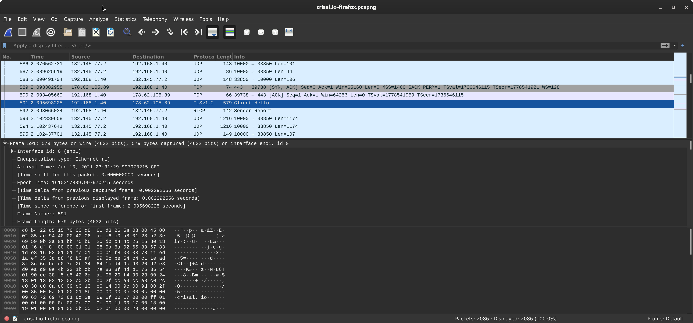
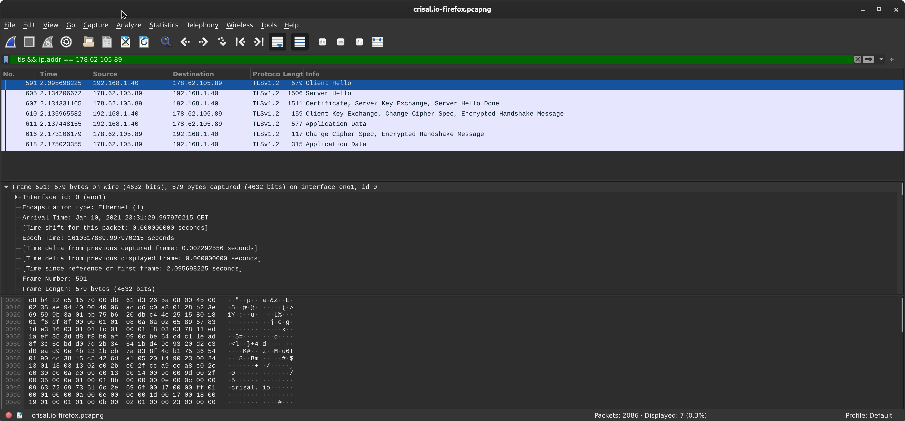
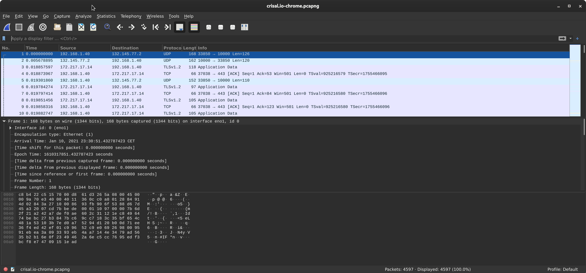
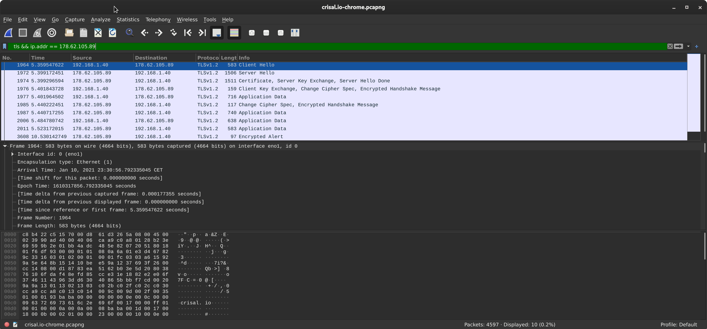

# Firefox

## Capturas





## Client Hello

### IPs de origen/destino

En el campo dedicado al protocolo podemos ver las direcciones de origen
y destino. También podemos ver el protocolo TCP, y la versión del mismo:

```
Internet Protocol Version 4, Src: 192.168.1.40, Dst: 178.62.105.89
  0100 .... = Version: 4
  .... 0101 = Header Length: 20 bytes (5)
  Differentiated Services Field: 0x00 (DSCP: CS0, ECN: Not-ECT)
    0000 00.. = Differentiated Services Codepoint: Default (0)
    .... ..00 = Explicit Congestion Notification: Not ECN-Capable Transport (0)
  Total Length: 565
  Identification: 0xae94 (44692)
  Flags: 0x40, Don't fragment
    0... .... = Reserved bit: Not set
    .1.. .... = Don't fragment: Set
    ..0. .... = More fragments: Not set
  Fragment Offset: 0
  Time to Live: 64
  Protocol: TCP (6)
  Header Checksum: 0xacc6 [validation disabled]
  [Header checksum status: Unverified]
  Source Address: 192.168.1.40
  Destination Address: 178.62.105.89
  [Destination GeoIP: London, GB]
  [... snip ...]
```

### Ciphersuites / extensiones / server name

En el campo dedicado a TLS (_Transport Layer Security_) podemos ver fácilmente
la lista de protocolos que soporta (_Cipher Suites_), junto a las extensiones
(_Extensions_). En la extensión `server_name`, podemos ver el nombre del
servidor de destino (`crisal.io` en este caso):

```
Transport Layer Security
  TLSv1.2 Record Layer: Handshake Protocol: Client Hello
    Content Type: Handshake (22)
    Version: TLS 1.0 (0x0301)
    Length: 508
    Handshake Protocol: Client Hello
      Handshake Type: Client Hello (1)
      Length: 504
      Version: TLS 1.2 (0x0303)
      Random: 7811ed1aef353dd8f8b0af090cbe64c4c11ead8f3c6cbdd07d2b34641bd49c93
        GMT Unix Time: Nov  1, 2033 07:52:10.000000000 CET
        Random Bytes: ef353dd8f8b0af090cbe64c4c11ead8f3c6cbdd07d2b34641bd49c93
      Session ID Length: 32
      Session ID: d2e3d0ead90e4b231bcb7a838f4db17536540190cc38f5c5426da10520f49023
      Cipher Suites Length: 36
      Cipher Suites (18 suites)
        Cipher Suite: TLS_AES_128_GCM_SHA256 (0x1301)
        Cipher Suite: TLS_CHACHA20_POLY1305_SHA256 (0x1303)
        Cipher Suite: TLS_AES_256_GCM_SHA384 (0x1302)
        Cipher Suite: TLS_ECDHE_ECDSA_WITH_AES_128_GCM_SHA256 (0xc02b)
        Cipher Suite: TLS_ECDHE_RSA_WITH_AES_128_GCM_SHA256 (0xc02f)
        Cipher Suite: TLS_ECDHE_ECDSA_WITH_CHACHA20_POLY1305_SHA256 (0xcca9)
        Cipher Suite: TLS_ECDHE_RSA_WITH_CHACHA20_POLY1305_SHA256 (0xcca8)
        Cipher Suite: TLS_ECDHE_ECDSA_WITH_AES_256_GCM_SHA384 (0xc02c)
        Cipher Suite: TLS_ECDHE_RSA_WITH_AES_256_GCM_SHA384 (0xc030)
        Cipher Suite: TLS_ECDHE_ECDSA_WITH_AES_256_CBC_SHA (0xc00a)
        Cipher Suite: TLS_ECDHE_ECDSA_WITH_AES_128_CBC_SHA (0xc009)
        Cipher Suite: TLS_ECDHE_RSA_WITH_AES_128_CBC_SHA (0xc013)
        Cipher Suite: TLS_ECDHE_RSA_WITH_AES_256_CBC_SHA (0xc014)
        Cipher Suite: TLS_RSA_WITH_AES_128_GCM_SHA256 (0x009c)
        Cipher Suite: TLS_RSA_WITH_AES_256_GCM_SHA384 (0x009d)
        Cipher Suite: TLS_RSA_WITH_AES_128_CBC_SHA (0x002f)
        Cipher Suite: TLS_RSA_WITH_AES_256_CBC_SHA (0x0035)
        Cipher Suite: TLS_RSA_WITH_3DES_EDE_CBC_SHA (0x000a)
      Compression Methods Length: 1
      Compression Methods (1 method)
        Compression Method: null (0)
      Extensions Length: 395
      Extension: server_name (len=14)
        Type: server_name (0)
        Length: 14
        Server Name Indication extension
          Server Name list length: 12
          Server Name Type: host_name (0)
          Server Name length: 9
          Server Name: crisal.io
      Extension: extended_master_secret (len=0)
        Type: extended_master_secret (23)
        Length: 0
      Extension: renegotiation_info (len=1)
        Type: renegotiation_info (65281)
        Length: 1
        Renegotiation Info extension
          Renegotiation info extension length: 0
      Extension: supported_groups (len=14)
        Type: supported_groups (10)
        Length: 14
        Supported Groups List Length: 12
        Supported Groups (6 groups)
          Supported Group: x25519 (0x001d)
          Supported Group: secp256r1 (0x0017)
          Supported Group: secp384r1 (0x0018)
          Supported Group: secp521r1 (0x0019)
          Supported Group: ffdhe2048 (0x0100)
          Supported Group: ffdhe3072 (0x0101)
      Extension: ec_point_formats (len=2)
        Type: ec_point_formats (11)
        Length: 2
        EC point formats Length: 1
        Elliptic curves point formats (1)
          EC point format: uncompressed (0)
      Extension: session_ticket (len=0)
        Type: session_ticket (35)
        Length: 0
        Data (0 bytes)
      Extension: application_layer_protocol_negotiation (len=14)
        Type: application_layer_protocol_negotiation (16)
        Length: 14
        ALPN Extension Length: 12
        ALPN Protocol
          ALPN string length: 2
          ALPN Next Protocol: h2
          ALPN string length: 8
          ALPN Next Protocol: http/1.1
      Extension: status_request (len=5)
        Type: status_request (5)
        Length: 5
        Certificate Status Type: OCSP (1)
        Responder ID list Length: 0
        Request Extensions Length: 0
      Extension: Unknown type 34 (len=10)
        Type: Unknown (34)
        Length: 10
        Data: 00080403050306030203
      Extension: key_share (len=107)
        Type: key_share (51)
        Length: 107
        Key Share extension
          Client Key Share Length: 105
          Key Share Entry: Group: x25519, Key Exchange length: 32
            Group: x25519 (29)
            Key Exchange Length: 32
            Key Exchange: d540d34cfda473f9aa172c82552c5d17b4111c2f94a110e0585c331d53540f49
          Key Share Entry: Group: secp256r1, Key Exchange length: 65
            Group: secp256r1 (23)
            Key Exchange Length: 65
            Key Exchange: 0436036722f8a6a3095d655dde8309085b9e087463472fd36bb49f7a6c60749d576d3aa8…
      Extension: supported_versions (len=5)
        Type: supported_versions (43)
        Length: 5
        Supported Versions length: 4
        Supported Version: TLS 1.3 (0x0304)
        Supported Version: TLS 1.2 (0x0303)
      Extension: signature_algorithms (len=24)
        Type: signature_algorithms (13)
        Length: 24
        Signature Hash Algorithms Length: 22
        Signature Hash Algorithms (11 algorithms)
          Signature Algorithm: ecdsa_secp256r1_sha256 (0x0403)
          Signature Algorithm: ecdsa_secp384r1_sha384 (0x0503)
          Signature Algorithm: ecdsa_secp521r1_sha512 (0x0603)
          Signature Algorithm: rsa_pss_rsae_sha256 (0x0804)
          Signature Algorithm: rsa_pss_rsae_sha384 (0x0805)
          Signature Algorithm: rsa_pss_rsae_sha512 (0x0806)
          Signature Algorithm: rsa_pkcs1_sha256 (0x0401)
          Signature Algorithm: rsa_pkcs1_sha384 (0x0501)
          Signature Algorithm: rsa_pkcs1_sha512 (0x0601)
          Signature Algorithm: ecdsa_sha1 (0x0203)
          Signature Algorithm: rsa_pkcs1_sha1 (0x0201)
      Extension: psk_key_exchange_modes (len=2)
        Type: psk_key_exchange_modes (45)
        Length: 2
        PSK Key Exchange Modes Length: 1
        PSK Key Exchange Mode: PSK with (EC)DHE key establishment (psk_dhe_ke) (1)
      Extension: record_size_limit (len=2)
        Type: record_size_limit (28)
        Length: 2
        Record Size Limit: 16385
      Extension: padding (len=135)
        Type: padding (21)
        Length: 135
        Padding Data: 000000000000000000000000000000000000000000000000000000000000000000000000…
```

## Server Hello

### Ciphersuite seleccionada por el servidor

Podemos ver como la ciphersuite seleccionada por el servidor es
`TLS_ECDHE_RSA_WITH_AES_128_GCM_SHA256`, que es la cuarta en la lista enviada
por el cliente.

```
Transport Layer Security
  TLSv1.2 Record Layer: Handshake Protocol: Server Hello
    Handshake Protocol: Server Hello
      Cipher Suite: TLS_ECDHE_RSA_WITH_AES_128_GCM_SHA256 (0xc02f)
```

Comprobamos cómo el navegador en efecto muestra el valor correcto:


## Server Hello Done

El paquete identificado como Server Hello Done, también contiene el certificado
del servidor, el intercambio de claves del servidor, y el hello done como tal.

Podemos ver cómo primero se envía la cadena de certificados (crisal.io, Let's
Encrypt, que es el Root CA), luego se envían los parámetros de la curva elíptica
x25519 (ECDHE = Elliptic Curve Diffie-Hellman (Ephemeral)), y finalmente se
envía el Hello Done, que es un mensaje vacío para indicar que no hay más
mensajes Server Hello. No tiene datos asociados, de acuerdo con el
[RFC](https://tools.ietf.org/html/rfc5246#section-7.4.5):

```
  struct { } ServerHelloDone;
```

```
Transport Layer Security
  TLSv1.2 Record Layer: Handshake Protocol: Certificate
    Content Type: Handshake (22)
    Version: TLS 1.2 (0x0303)
    Length: 2449
    Handshake Protocol: Certificate
      Handshake Type: Certificate (11)
      Length: 2445
      Certificates Length: 2442
      Certificates (2442 bytes)
        Certificate Length: 1307
        Certificate: 30820517308203ffa003020102021203a1fd797df2ad5c79bc784db8d902f49ab2300d06… (id-at-commonName=crisal.io)
        Certificate Length: 1129
        Certificate: 308204653082034da0030201020210400175048314a4c8218c84a90c16cddf300d06092a… (id-at-commonName=R3,id-at-organizationName=Let's Encrypt,id-at-countryName=US)
  TLSv1.2 Record Layer: Handshake Protocol: Server Key Exchange
    Content Type: Handshake (22)
    Version: TLS 1.2 (0x0303)
    Length: 300
    Handshake Protocol: Server Key Exchange
      Handshake Type: Server Key Exchange (12)
      Length: 296
      EC Diffie-Hellman Server Params
        Curve Type: named_curve (0x03)
        Named Curve: x25519 (0x001d)
        Pubkey Length: 32
        Pubkey: c895efc65db2f6044fc071ec214b349c18291f54974515e7db4ba5d407164629
        Signature Algorithm: rsa_pkcs1_sha256 (0x0401)
        Signature Length: 256
        Signature: 0b7273e3474761095cd092b3f348f4c5277da00fc657ed352d4ffaf4bdf334e77c3c43c4…
  TLSv1.2 Record Layer: Handshake Protocol: Server Hello Done
    Content Type: Handshake (22)
    Version: TLS 1.2 (0x0303)
    Length: 4
    Handshake Protocol: Server Hello Done
      Handshake Type: Server Hello Done (14)
      Length: 0
```

# Chrome

## Capturas





## Client Hello

### IPs de origen/destino

Siguiendo el mismo procedimiento, podemos ver como las IPs de origen y destino
coinciden:

```
Internet Protocol Version 4, Src: 192.168.1.40, Dst: 178.62.105.89
0100 .... = Version: 4
  .... 0101 = Header Length: 20 bytes (5)
  Differentiated Services Field: 0x00 (DSCP: CS0, ECN: Not-ECT)
    0000 00.. = Differentiated Services Codepoint: Default (0)
    .... ..00 = Explicit Congestion Notification: Not ECN-Capable Transport (0)
  Total Length: 569
  Identification: 0x90ad (37037)
  Flags: 0x40, Don't fragment
    0... .... = Reserved bit: Not set
    .1.. .... = Don't fragment: Set
    ..0. .... = More fragments: Not set
  Fragment Offset: 0
  Time to Live: 64
  Protocol: TCP (6)
  Header Checksum: 0xcaa9 [validation disabled]
  [Header checksum status: Unverified]
  Source Address: 192.168.1.40
  Destination Address: 178.62.105.89
  [Destination GeoIP: London, GB]
  [...snip...]
```

### Ciphersuites / extensiones / server name

Podemos ver como Chrome envía una lista de Ciphersuites algo más pequeña que
Firefox (16 vs. 18). Primero, envía un [valor desconocido
(GREASE)](https://tools.ietf.org/html/draft-davidben-tls-grease-01), algo que
[Chrome hace para detectar servidores
rotos](https://www.chromestatus.com/feature/6475903378915328).

El orden de algunas entradas comunes varía con respecto a Firefox. Por ejemplo,
Chrome prefiere `TLS_AES_256_GCM_SHA384` a `TLS_CHACHA20_POLY1305_SHA256`,
mientras que Firefox los prefiere en el orden inverso.

Las Cipher Suites que Chrome no anuncia pero Firefox sí son:

 * `TLS_RSA_WITH_3DES_EDE_CBC_SHA`
 * `TLS_ECDHE_ECDSA_WITH_AES_256_CBC_SHA`
 * `TLS_ECDHE_ECDSA_WITH_AES_128_CBC_SHA`

El primero usa triple-DES así que Chrome no lo anuncia por defecto (lo considera
[sólo un
fallback](https://bugs.chromium.org/p/chromium/issues/detail?id=691888) desde
Febrero de 2020). Hay un [bug en
Firefox](https://bugzilla.mozilla.org/show_bug.cgi?id=1227524) para considerar
hacer lo mismo.

Los dos últimos usan CBC con ECDSA y también fueron [eliminados por
Chrome](https://www.chromestatus.com/feature/5740978103123968)
[intencionalmente](https://bugs.chromium.org/p/chromium/issues/detail?id=658341).

Vemos como en el campo de las extensiones también hay un valor GREASE, y Firefox
también soporta un mayor número de algoritmos de firma (`signature_algorithms`):

 * `ecdsa_secp521r1_sha512`
 * `ecdsa_sha1`
 * `rsa_pkcs1_sha1`

En el campo de extensión `server_name` también podemos ver el hostname
(`crisal.io`).

Otra de las diferencias es que en la extensión `supported_versions`, Chrome
anuncia soporte para TLS 1.0 y 1.1, mientras que Firefox no.

Chrome envía alguna extensión para comprimir el certificado con brotli
(`compress_certificate`), por ejemplo.

Firefox soporta algún grupo además de curvas elípticas para intercambiar claves
[`supported_groups`](https://trac.tools.ietf.org/html/draft-ietf-tls-rfc8446bis-00#section-4.2.7),
`ffdhe2048` y `ffdhe3072`, que son [Finite Field
Groups](https://en.wikipedia.org/wiki/Finite_field#Applications).

Firefox soporta también
[`delegated_credentials`](https://tools.ietf.org/html/draft-ietf-tls-subcerts-09),
que la versión de `wireshark` que teníamos no reconoce (`Unknown type (34)`).

Firefox utiliza la extensión
[`record_size_limit`](https://trac.tools.ietf.org/html/rfc8449) para reducir el
tamaño máximo de cada fragmento cifrado a 16385 bytes.

```
Transport Layer Security
  TLSv1.2 Record Layer: Handshake Protocol: Client Hello
    Content Type: Handshake (22)
    Version: TLS 1.0 (0x0301)
    Length: 512
    Handshake Protocol: Client Hello
      Handshake Type: Client Hello (1)
      Length: 508
      Version: TLS 1.2 (0x0303)
      Random: a615929a5e648b151410bee59a1237693f2600cc140800d18783ea5162b03e5d
        GMT Unix Time: Apr 19, 2058 10:47:22.000000000 CEST
        Random Bytes: 5e648b151410bee59a1237693f2600cc140800d18783ea5162b03e5d
      Session ID Length: 32
      Session ID: 803876106fdaf48efd85cce31e1882e2e06f37461143963dd63040865bbbf7cd
      Cipher Suites Length: 32
      Cipher Suites (16 suites)
        Cipher Suite: Reserved (GREASE) (0x9a9a)
        Cipher Suite: TLS_AES_128_GCM_SHA256 (0x1301)
        Cipher Suite: TLS_AES_256_GCM_SHA384 (0x1302)
        Cipher Suite: TLS_CHACHA20_POLY1305_SHA256 (0x1303)
        Cipher Suite: TLS_ECDHE_ECDSA_WITH_AES_128_GCM_SHA256 (0xc02b)
        Cipher Suite: TLS_ECDHE_RSA_WITH_AES_128_GCM_SHA256 (0xc02f)
        Cipher Suite: TLS_ECDHE_ECDSA_WITH_AES_256_GCM_SHA384 (0xc02c)
        Cipher Suite: TLS_ECDHE_RSA_WITH_AES_256_GCM_SHA384 (0xc030)
        Cipher Suite: TLS_ECDHE_ECDSA_WITH_CHACHA20_POLY1305_SHA256 (0xcca9)
        Cipher Suite: TLS_ECDHE_RSA_WITH_CHACHA20_POLY1305_SHA256 (0xcca8)
        Cipher Suite: TLS_ECDHE_RSA_WITH_AES_128_CBC_SHA (0xc013)
        Cipher Suite: TLS_ECDHE_RSA_WITH_AES_256_CBC_SHA (0xc014)
        Cipher Suite: TLS_RSA_WITH_AES_128_GCM_SHA256 (0x009c)
        Cipher Suite: TLS_RSA_WITH_AES_256_GCM_SHA384 (0x009d)
        Cipher Suite: TLS_RSA_WITH_AES_128_CBC_SHA (0x002f)
        Cipher Suite: TLS_RSA_WITH_AES_256_CBC_SHA (0x0035)
      Compression Methods Length: 1
      Compression Methods (1 method)
        Compression Method: null (0)
      Extensions Length: 403
      Extension: Reserved (GREASE) (len=0)
        Type: Reserved (GREASE) (47802)
        Length: 0
        Data: <MISSING>
      Extension: server_name (len=14)
        Type: server_name (0)
        Length: 14
        Server Name Indication extension
          Server Name list length: 12
          Server Name Type: host_name (0)
          Server Name length: 9
          Server Name: crisal.io
      Extension: extended_master_secret (len=0)
        Type: extended_master_secret (23)
        Length: 0
      Extension: renegotiation_info (len=1)
        Type: renegotiation_info (65281)
        Length: 1
        Renegotiation Info extension
          Renegotiation info extension length: 0
      Extension: supported_groups (len=10)
        Type: supported_groups (10)
        Length: 10
        Supported Groups List Length: 8
        Supported Groups (4 groups)
          Supported Group: Reserved (GREASE) (0xbaba)
          Supported Group: x25519 (0x001d)
          Supported Group: secp256r1 (0x0017)
          Supported Group: secp384r1 (0x0018)
      Extension: ec_point_formats (len=2)
        Type: ec_point_formats (11)
        Length: 2
        EC point formats Length: 1
        Elliptic curves point formats (1)
          EC point format: uncompressed (0)
      Extension: session_ticket (len=0)
        Type: session_ticket (35)
        Length: 0
        Data (0 bytes)
      Extension: application_layer_protocol_negotiation (len=14)
        Type: application_layer_protocol_negotiation (16)
        Length: 14
        ALPN Extension Length: 12
        ALPN Protocol
          ALPN string length: 2
          ALPN Next Protocol: h2
          ALPN string length: 8
          ALPN Next Protocol: http/1.1
      Extension: status_request (len=5)
        Type: status_request (5)
        Length: 5
        Certificate Status Type: OCSP (1)
        Responder ID list Length: 0
        Request Extensions Length: 0
      Extension: signature_algorithms (len=18)
        Type: signature_algorithms (13)
        Length: 18
        Signature Hash Algorithms Length: 16
        Signature Hash Algorithms (8 algorithms)
          Signature Algorithm: ecdsa_secp256r1_sha256 (0x0403)
          Signature Algorithm: rsa_pss_rsae_sha256 (0x0804)
          Signature Algorithm: rsa_pkcs1_sha256 (0x0401)
          Signature Algorithm: ecdsa_secp384r1_sha384 (0x0503)
          Signature Algorithm: rsa_pss_rsae_sha384 (0x0805)
          Signature Algorithm: rsa_pkcs1_sha384 (0x0501)
          Signature Algorithm: rsa_pss_rsae_sha512 (0x0806)
          Signature Algorithm: rsa_pkcs1_sha512 (0x0601)
      Extension: signed_certificate_timestamp (len=0)
        Type: signed_certificate_timestamp (18)
        Length: 0
      Extension: key_share (len=43)
        Type: key_share (51)
        Length: 43
        Key Share extension
          Client Key Share Length: 41
          Key Share Entry: Group: Reserved (GREASE), Key Exchange length: 1
            Group: Reserved (GREASE) (47802)
            Key Exchange Length: 1
            Key Exchange: 00
          Key Share Entry: Group: x25519, Key Exchange length: 32
            Group: x25519 (29)
            Key Exchange Length: 32
            Key Exchange: 750d84f37d00829ee93c4cb12742977a66d9ef2c8948d23857b4cf5d5133c108
      Extension: psk_key_exchange_modes (len=2)
        Type: psk_key_exchange_modes (45)
        Length: 2
        PSK Key Exchange Modes Length: 1
        PSK Key Exchange Mode: PSK with (EC)DHE key establishment (psk_dhe_ke) (1)
      Extension: supported_versions (len=11)
        Type: supported_versions (43)
        Length: 11
        Supported Versions length: 10
        Supported Version: Unknown (0x5a5a)
        Supported Version: TLS 1.3 (0x0304)
        Supported Version: TLS 1.2 (0x0303)
        Supported Version: TLS 1.1 (0x0302)
        Supported Version: TLS 1.0 (0x0301)
      Extension: compress_certificate (len=3)
        Type: compress_certificate (27)
        Length: 3
        Algorithms Length: 2
        Algorithm: brotli (2)
      Extension: Reserved (GREASE) (len=1)
        Type: Reserved (GREASE) (56026)
        Length: 1
        Data: 00
      Extension: padding (len=211)
        Type: padding (21)
        Length: 211
        Padding Data: 000000000000000000000000000000000000000000000000000000000000000000000000…
```

## Server Hello

### Ciphersuite seleccionada por el servidor

La suite de cifrado seleccionada en este caso coincide con Firefox también:

```
Transport Layer Security
  TLSv1.2 Record Layer: Handshake Protocol: Server Hello
    Handshake Protocol: Server Hello
      Cipher Suite: TLS_ECDHE_RSA_WITH_AES_128_GCM_SHA256 (0xc02f)
```


## Server Hello Done

Misma vaina en este caso, el paquete del Server Hello Done también contiene el
certificado del servidor, el intercambio de claves del servidor, y el hello done
como tal.

Los parámetros son idénticos, salvo por la clave pública y firma de ECDHE
(Server Key Exchange -> EC Diffie-Hellman Server Params -> PubKey / Signature),
que es efímera y por lo tanto difiere entre conexiones.

```
Transport Layer Security
  TLSv1.2 Record Layer: Handshake Protocol: Certificate
    Content Type: Handshake (22)
    Version: TLS 1.2 (0x0303)
    Length: 2449
    Handshake Protocol: Certificate
      Handshake Type: Certificate (11)
      Length: 2445
      Certificates Length: 2442
      Certificates (2442 bytes)
        Certificate Length: 1307
        Certificate: 30820517308203ffa003020102021203a1fd797df2ad5c79bc784db8d902f49ab2300d06… (id-at-commonName=crisal.io)
        Certificate Length: 1129
        Certificate: 308204653082034da0030201020210400175048314a4c8218c84a90c16cddf300d06092a… (id-at-commonName=R3,id-at-organizationName=Let's Encrypt,id-at-countryName=US)
  TLSv1.2 Record Layer: Handshake Protocol: Server Key Exchange
    Content Type: Handshake (22)
    Version: TLS 1.2 (0x0303)
    Length: 300
    Handshake Protocol: Server Key Exchange
      Handshake Type: Server Key Exchange (12)
      Length: 296
      EC Diffie-Hellman Server Params
        Curve Type: named_curve (0x03)
        Named Curve: x25519 (0x001d)
        Pubkey Length: 32
        Pubkey: fb2ffae65ce2cb66c661aa7c28403041d53fb60d5f6f888763de977a03b2d706
        Signature Algorithm: rsa_pkcs1_sha256 (0x0401)
        Signature Length: 256
        Signature: 7d35848af4a1863e7b6a30423d4e7776d037865b4027f58f103c964806417c97819af4a8…
  TLSv1.2 Record Layer: Handshake Protocol: Server Hello Done
    Content Type: Handshake (22)
    Version: TLS 1.2 (0x0303)
    Length: 4
    Handshake Protocol: Server Hello Done
      Handshake Type: Server Hello Done (14)
      Length: 0
```
