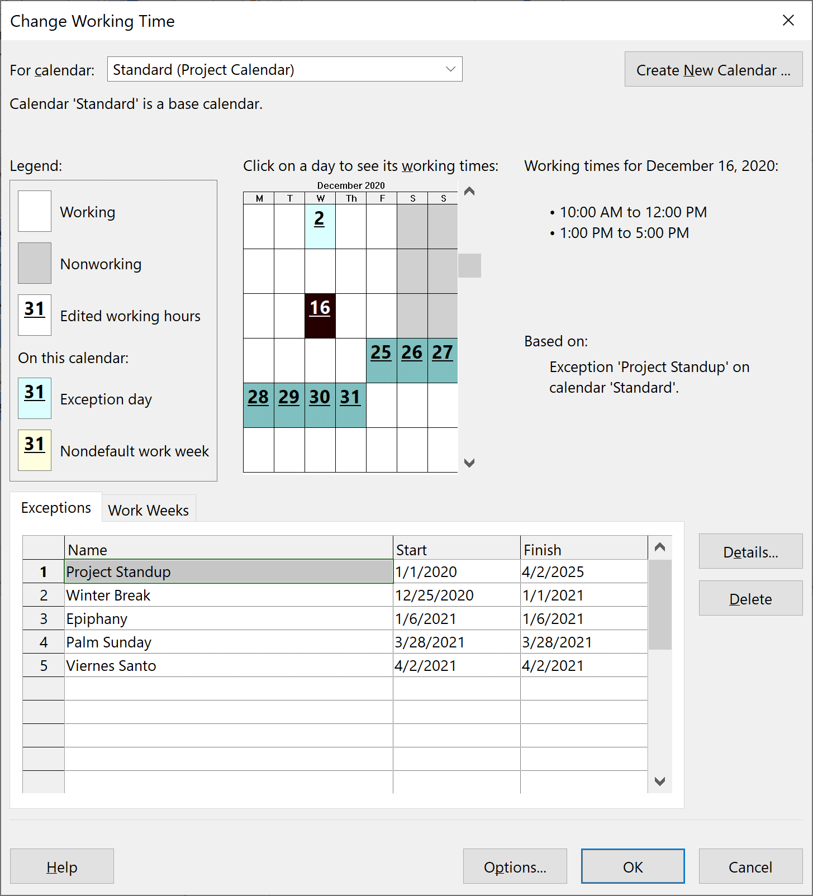

# Elaboración de calendario de trabajo

Lo primero que he hecho ha sido elaborar un calendario de trabajo asignando
varias fiestas nacionales. Hemos puesto el 16/12/2020 como fecha inicial del
proyecto.

# Fases del proceso unificado

Como se pide en el enunciado y la descripción de la práctica, he tomado como
referencia el proceso unificado a la hora de estructurar el proyecto.

Por cuestiones de tiempo, no he terminado de poner todas las fases, iteraciones,
etc, por lo que es difícil contrastar con la estimación del esfuerzo de la
práctica 1, especialmente dado que la fase de construcción de este proyecto es
particularmente grande ya que tiene funcionalidad bastante variada. Dicho eso,
la gran mayoría de los casos de usos son similares (gestión y manejo de datos),
por lo que no creo que sea una gran pérdida (módulo eso).

## Fase de inicio

La fase de inicio es relativamente corta, y se emplea mayoritariamente en
modelado de negocio (especificación de recursos, reuniones con el cliente, etc),
e investigación de soluciones pre-existentes, aunque también se realiza un
primer mock-up que se usará en fases posteriores para conseguir feedback de
usuarios.

## Fase de elaboración

La fase de elaboración se ha empleado fundamentalmente en conocer los casos de
uso más en profundidad a base de tener entrevistas con usuarios, pero también se
ha usado para ir avanzando en las fases iniciales de la implementación.

## Fase de construcción

Esta es la fase más larga con mucha diferencia y dado el tamaño del equipo
requeriría bastantes iteraciones. Es donde se ejecuta casi toda la carga de
implementación y testing. Se ha comenzado implementando las bases tanto para la
interfaz como para el almacenamiento de los datos. Tras eso, se ha implementado
el control de usuarios, y una vez hecho eso, muchos de nuestros casos de uso
serían paralelizables.

## Fase de transición

No hemos llegado a este punto en la planificación, pero la gran mayoría del
tiempo aquí estaría dedicado a testing / QA / bug-fixing, y verificación de que
nuestra aplicación cumple los requisitos de rendimiento y availability que se
espera de ella.

# Tareas críticas

El camino crítico es como se espera: En la fase de elaboración está marcado por
el trabajo de UX, en la fase de construcción esa marcado por el trabajo de
implementación...

# Asignación de recursos y carga de trabajo

He asumido que vamos a tener un equipo relativamente equilibrado, pero pequeño,
para realizar la aplicación:

 * Dos programadores más orientados al back-end.
 * Un programador más orientado al front-end.
 * Un programador full-stack.
 * Un project manager.
 * Un UX researcher.

Se ha asumido que todos están trabajando a tiempo completo en este proyecto.

Las tareas se han asignado con respecto a las áreas de experiencia de cada uno,
y el programador full-stack se ha usado un poco como comodín al ser más
flexible, ayudando tanto a los programadores back-end como al front-end según
las necesidades de la etapa del prohyecto.

Como se puede esperar, hay miembros con más o menos carga de trabajo según
el la fase del proyecto.

Al principio del proyecto, el UX researcher no tiene ninguna holgura, por
ejemplo, mientras que los programadores están haciendo tareas menos críticas.
Una vez entramos en la fase de construcción y se han incorporado los
conocimientos adquiridos por UX al proyecto, este balance se invierte.

Dependiendo de la estructura organizativa en la que este proyecto se
desarrollaría, habría diferentes formas de lidiar con esto. Podríamos no tener
a todo el equipo trabajando a tiempo completo en este proyecto dependiendo de la
etapa. Si fuera una empresa grande, es probable que haya otros proyectos donde
pudieran aportar. Si fuera una empresa pequeña donde este es el único proyecto,
tal vez podría haber contratos más temporales (lo cual sería algo
desafortunado), o alternativamente, dependiendo de los intereses de las personas
implicadas, podría aprovecharse para expandir los conocimientos de las
mismas. Por ejemplo, los programadores back-end podrían ayudar con el front-end
o vice-versa, y salir un poco más de su zona de comfort.
