# Definición

 * _Uncrewed/Unmanned Aerial Vehicle_
 * En Español: VANT (_Vehículo Aéreo No Tripulado_).

---

# Historia

----

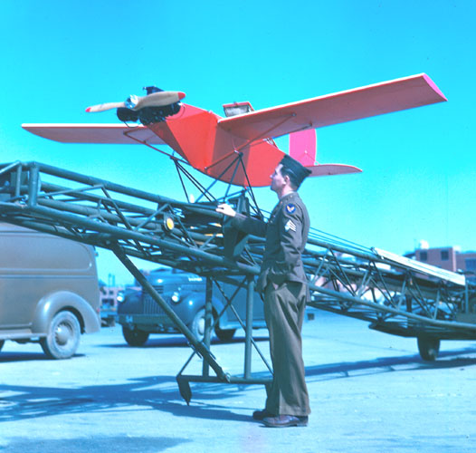

---

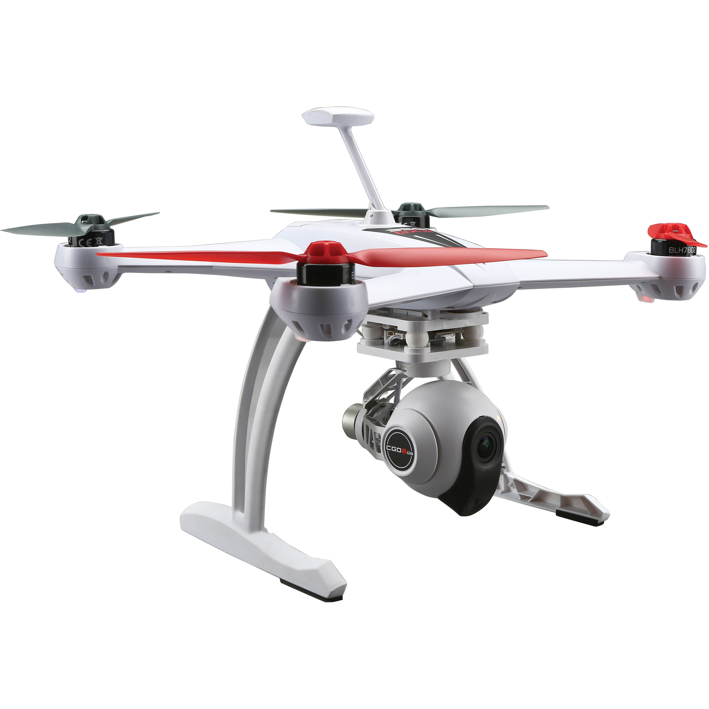

---

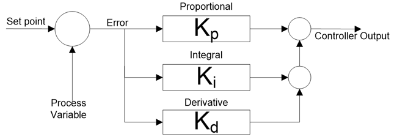

---

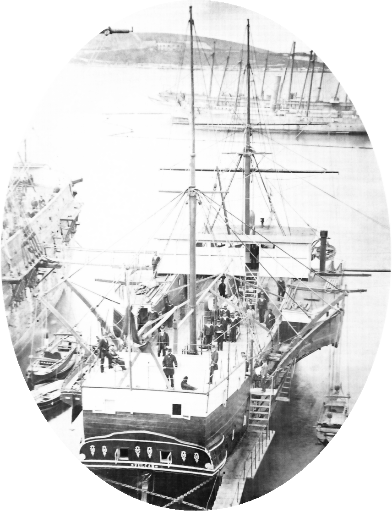

---

# Tipos de UAV

---

 * RPA (_Remotely Piloted Aircraft_).
 * No pilotado.
 * Mixto.

---

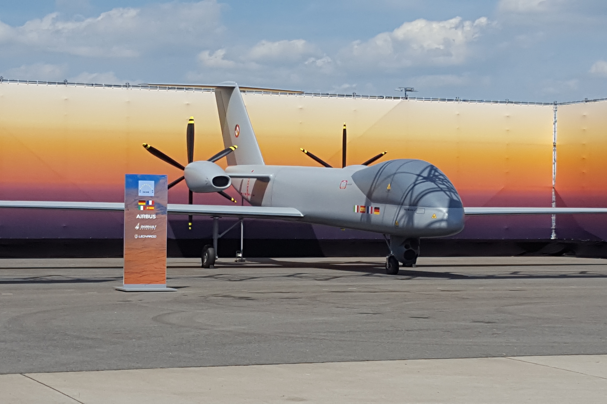

<small>Crédito: DeffiSK @ Wikipedia</small>

---

## Por tipo de uso

---

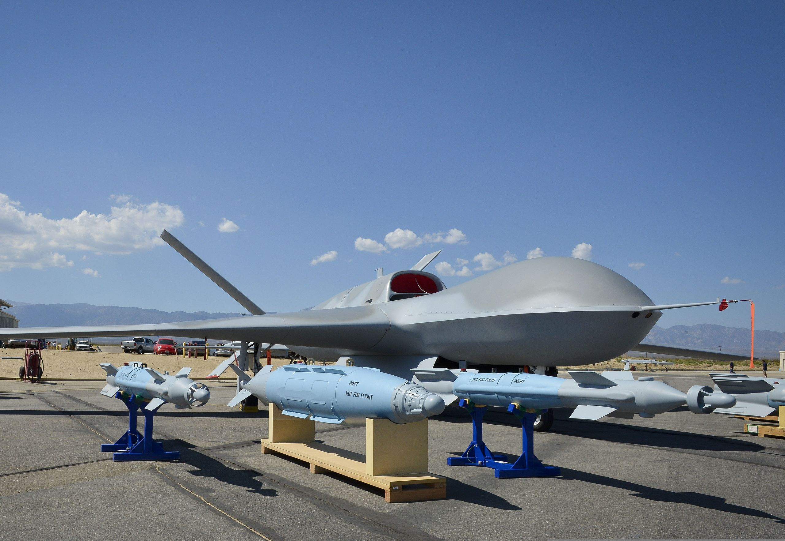

---

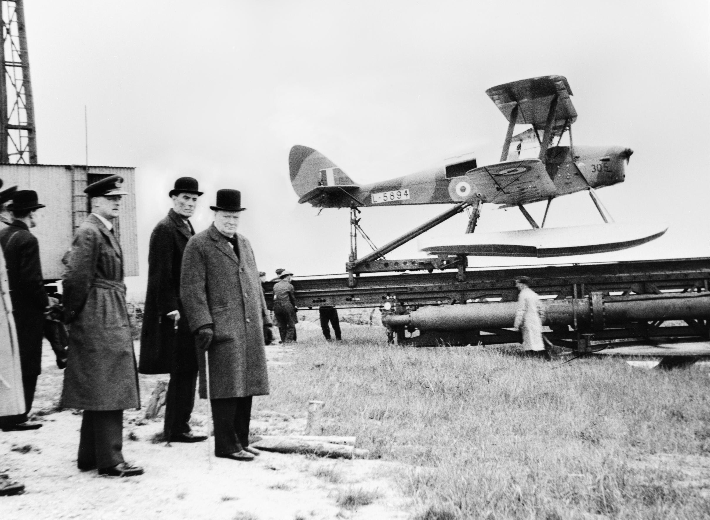

---

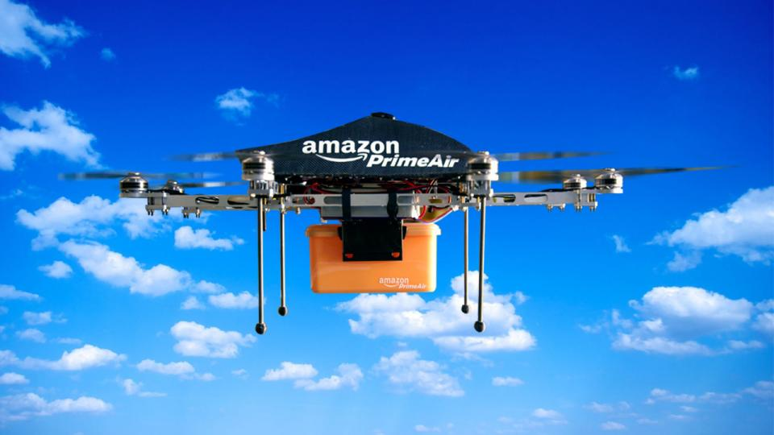

---

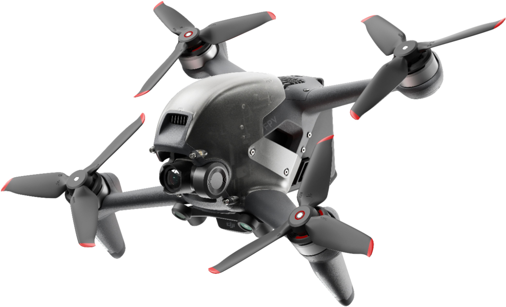

---

## Por capacidades

---

 * Peso máximo
 * Altitud operacional
 * Velocidad.
 * [https://en.wikipedia.org/wiki/U.S._military_UAS_groups](https://en.wikipedia.org/wiki/U.S._military_UAS_groups)

---

# Primoco UAV

---

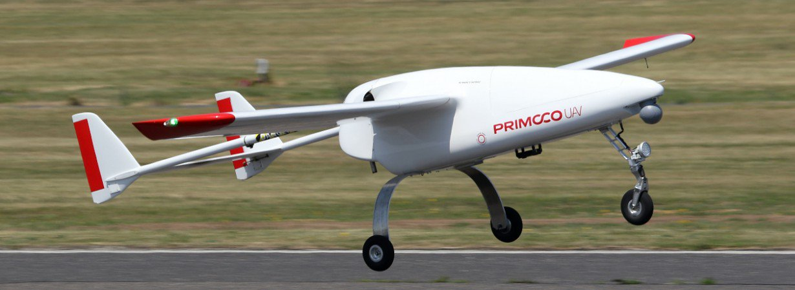

---

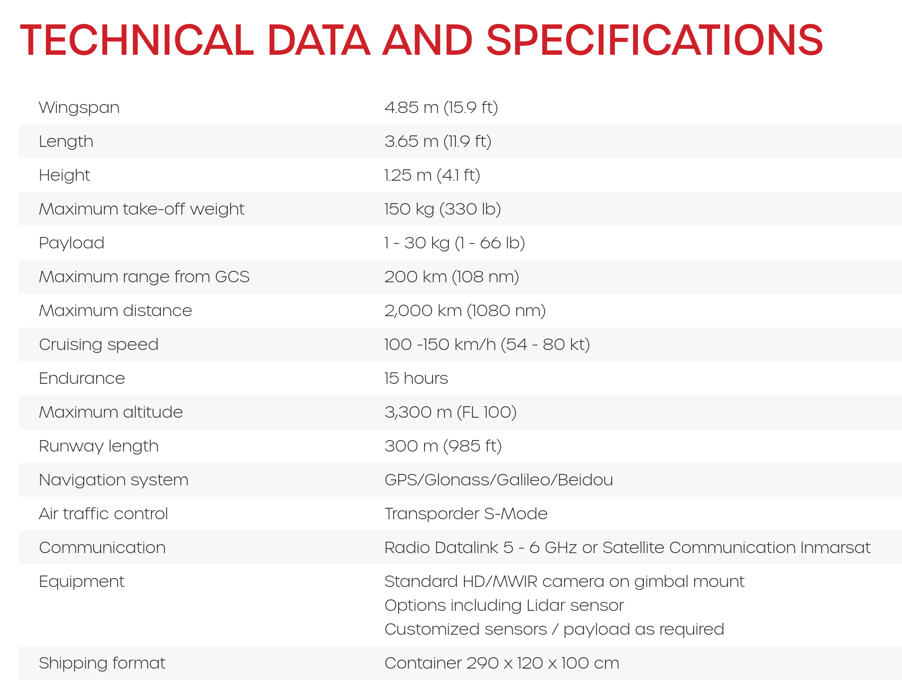

---

# ¿Preguntas?

<!--

---

# Arquitectura

La complejidad de un UAV es obviamente variable dependiendo de sus
requerimientos y su propósito, pero un dron comercial está compuesto de una
estructura similar a:

 * Batería (generalmente de polímero de ión Litio, LiPo). UAVs más grandes
   utilizan motores aeronáuticos o células de combustible.

 * Varios sensores

  * Externos: de posición (GPS), radares de luz, sonars, giroscopios,
    acelerómetros...

    * 6 ejes de libertad (DOF, _Degrees of Freedom_): Giroscopios
      y acelerómetros (IMU, _Initial Measurement Unit_).
    * 9 ejes de libertad: IMU + compás.
    * 10 ejes de libertad: IMU + compás + barómetro.
    * 11 ejes de libertad: IMU + compás + barómetro + GPS.

  * Internos: De batería, etc.

 * Actuadores:

  * Controlador de revoluciones del motor.
  * Servomotores para las direcciones etc
  * Otros (armas, leds, altavoces, ...)

 * Software:

  * Suelen ser un SBC (_Single Board Computer_), ya que tiene que operar en
    tiempo real.
  * Suelen estar escritos en C / C++ / Ensamblador / Rust...

-->
