# Introducción

---

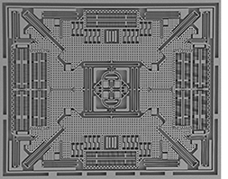

---

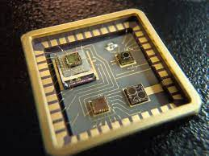

---

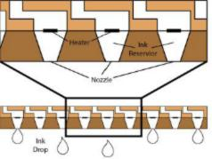

---

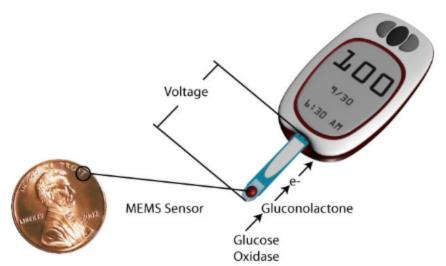

---

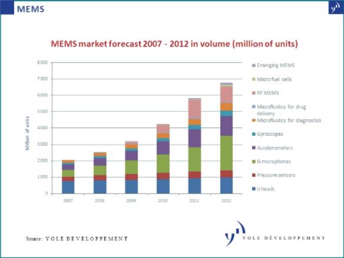

---

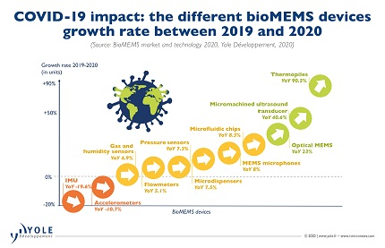

---

# Materiales

---

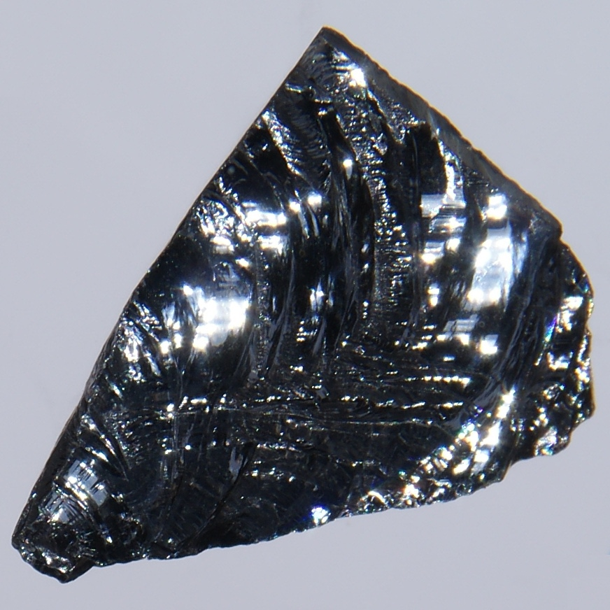

---

 * Buena relación calidad/precio, disponibilidad amplia, poca fatiga...

---

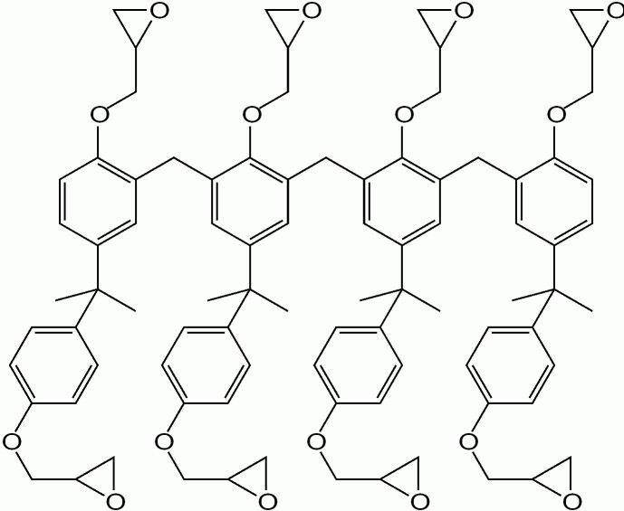

---

 * Complemento usos para los que el silicio no es tan buen fit.

 * e.g., película fotosensible para imprimir circuitos.

 * [_"Review of polymer MEMS
   micromachining"_](http://biomems.usc.edu/publications/2015/2015_JMM_polymer_micromachining.pdf)

---

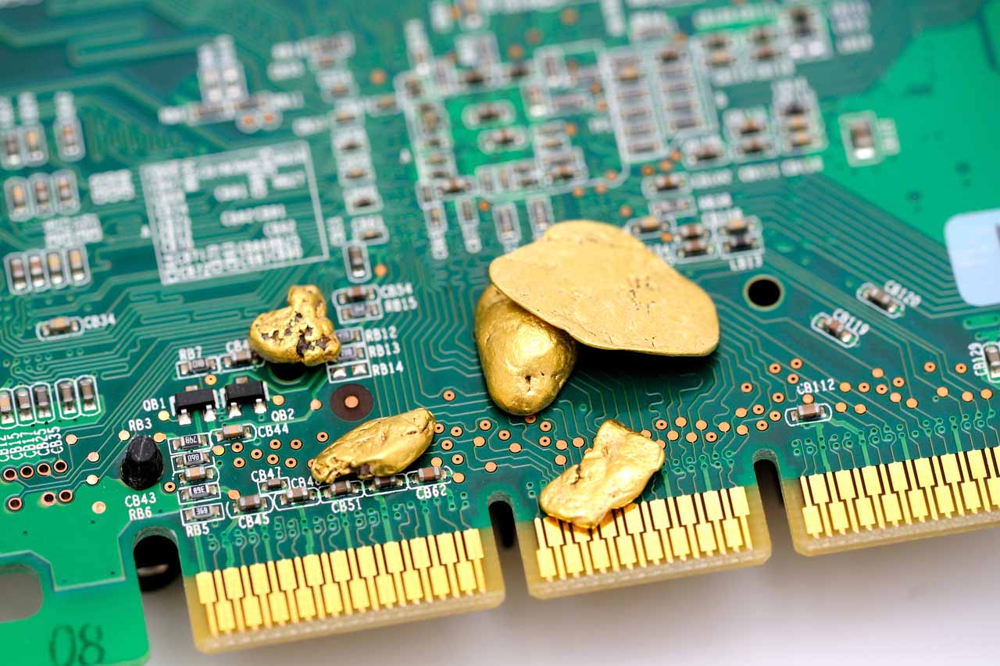

---

 * Maleables, buenos conductores...

---

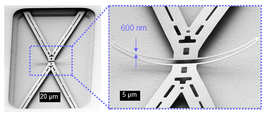

---

 * Buena resistencia contra la corrosión biológica

---

# Procesos de fabricación

---

## Deposición

 * Deposición de una película delgada de un material encima del sustrato.
 * Física:
   * Evaporación (térmica o e-beam).
   * Pulverización catódica (_sputtering_).
 * Química:
   * Evaporación química.
   * Oxidación térmica.

---

## Litografía

---

 * Fotolitografía (exposición a la luz de un material fotosensible).
 * Litografía e-beam (un haz de electrones sobre una lámina cubierta de
   polímero), ion-beam (mejor resolución), rayos X.

---

## Grabado

---

 * Húmedo (reacción química con un ácido).
 * En seco (plasma, reacción a base de presión y calor).

---

# Tipos y usos

----

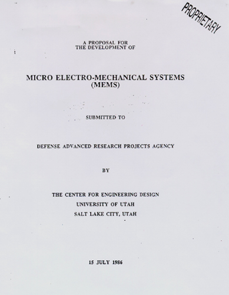

---

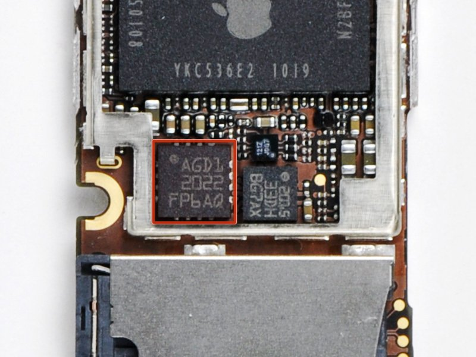

---

---

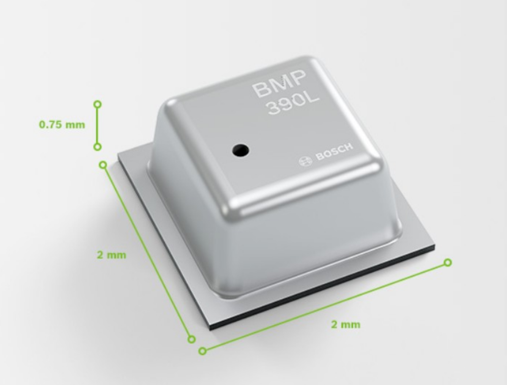

---

# ¿Preguntas?
